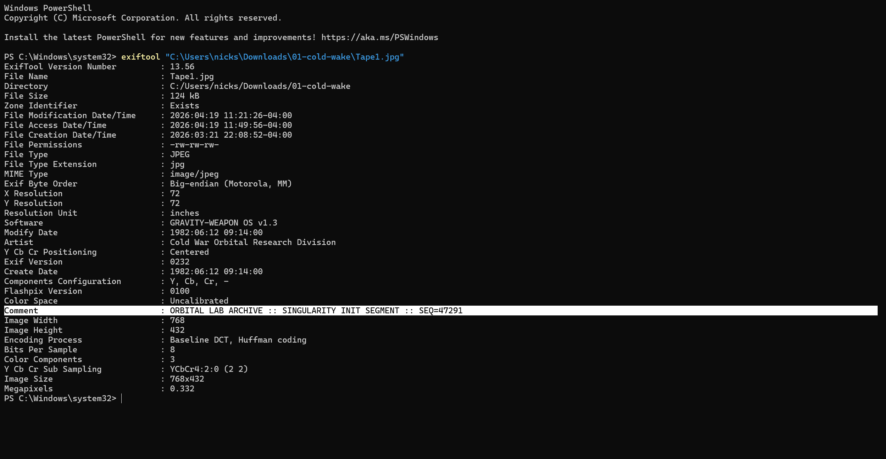
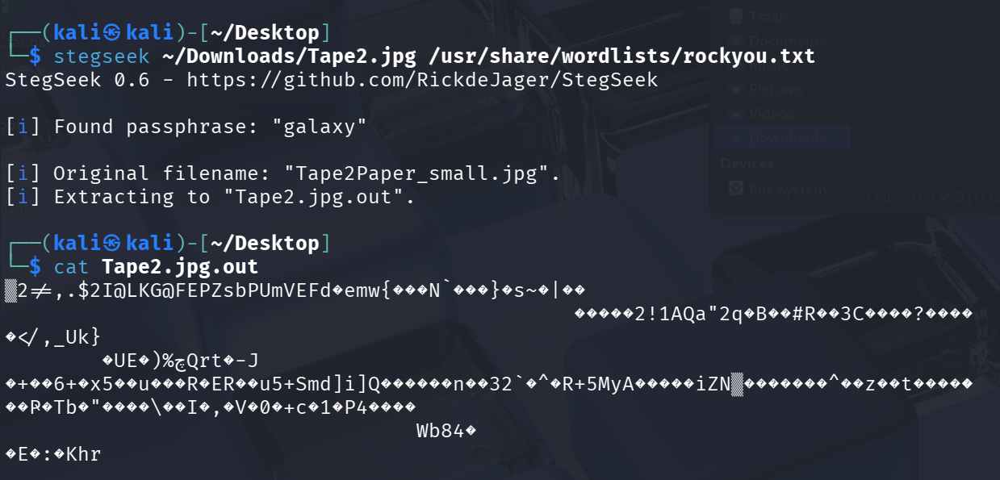
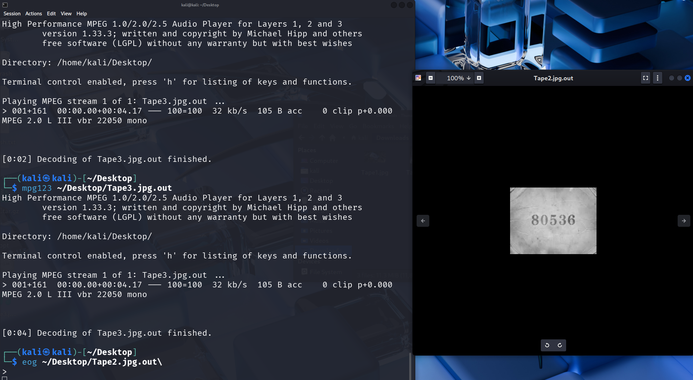

# Cold Wake
**Category:** Forensics | **Status:** Solved

Downloaded and unzipped the challenge file containing three cassette tape JPGs. Opened all three and inspected properties -- nothing of interest visually. Noticed immediately that Tape2 was significantly larger than the others: Tape1 was 124KB, Tape3 was 356KB, and Tape2 was 11MB. That size discrepancy is a classic indicator of steganography.

Ran ExifTool on all three. Tape1 had an interesting Comment field: `ORBITAL LAB ARCHIVE :: SINGULARITY INIT SEGMENT :: SEQ=47291` -- pulled the first segment of the flag from there: `47291`. Tape2 and Tape3 had no useful metadata.



Tried steghide manually on Tape2 and Tape3 with multiple themed passphrases -- "singularity," "orbital," "gravity," "cold-wake," "launch," "1982," and others. None worked, but the fact that steghide was prompting for a passphrase at all confirmed both files had hidden data embedded in them -- steghide only asks for a passphrase if it detects an embedded data structure.

Transferred all three files to Kali over a local Python HTTP server:

```powershell
# Windows -- served the files
cd "C:\Users\nicks\Downloads\01-cold-wake"
python -m http.server 8080
```

```bash
# Kali -- pulled them down
wget http://172.16.226.201:8080/Tape1.jpg http://172.16.226.201:8080/Tape2.jpg http://172.16.226.201:8080/Tape3.jpg
```

Ran stegseek (an automated passphrase brute forcer built specifically for steghide) against Tape2 and Tape3 using rockyou.txt:

```bash
stegseek ~/Downloads/Tape2.jpg /usr/share/wordlists/rockyou.txt
stegseek ~/Downloads/Tape3.jpg /usr/share/wordlists/rockyou.txt
```

Both cracked with the passphrase `galaxy`. Stegseek extracted the hidden data and dropped output files on the Desktop.



Used the `file` command to confirm what the extracted files actually were -- Tape2's output was a JPEG, Tape3's was an MP3. Opened the JPEG with `eog` and got the second flag segment: `80536`. Played the MP3 with `mpg123` -- a robotic voice read off the final segment: `19408`.



**Flag:** `JCTF{47291-80536-19408}`

**What I learned:** Each tape hid its segment differently -- metadata comment, steganography in an image, steganography in an audio file. The size difference between Tape2 and the others was the first real signal that something was hidden inside it. Steghide confirming a passphrase prompt on both files was the second confirmation before even cracking them.

Got more practice navigating Kali and using `file`, `eog`, and `mpg123` from the terminal. Still getting comfortable with Linux file paths and tool syntax but this was useful hands-on practice with stegseek specifically -- it's dramatically faster than a manual PowerShell loop for steghide brute forcing.

**Blue team takeaway:**

Steganography is used in real attacks to exfiltrate data out of a network hidden inside ordinary-looking image or audio files that pass through filters without triggering alerts. File size anomalies are one of the few passive indicators -- an image that's much larger than expected for its dimensions and content is worth a second look. Forensic tools like stegseek and binwalk can help identify and extract hidden payloads from media files during an investigation.
