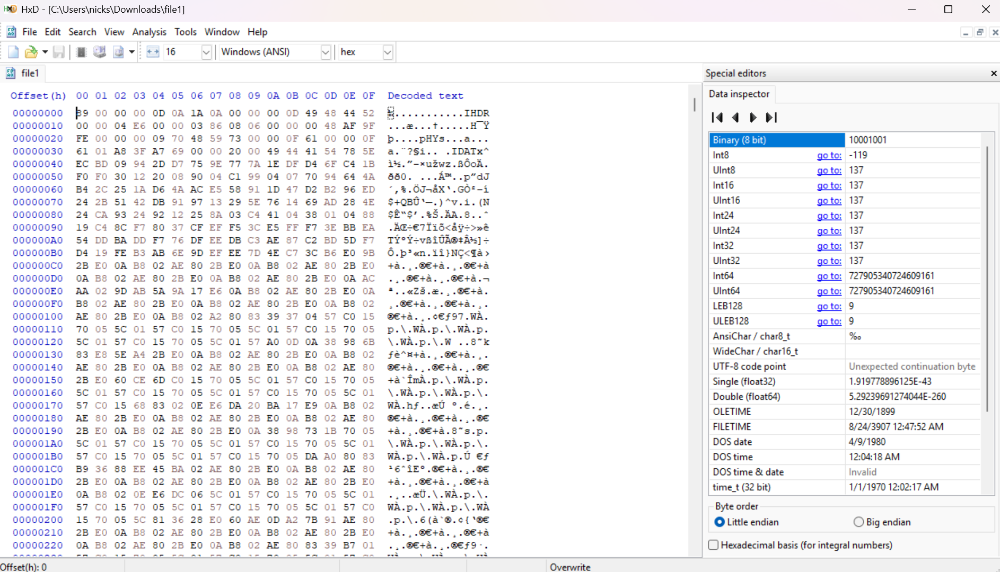
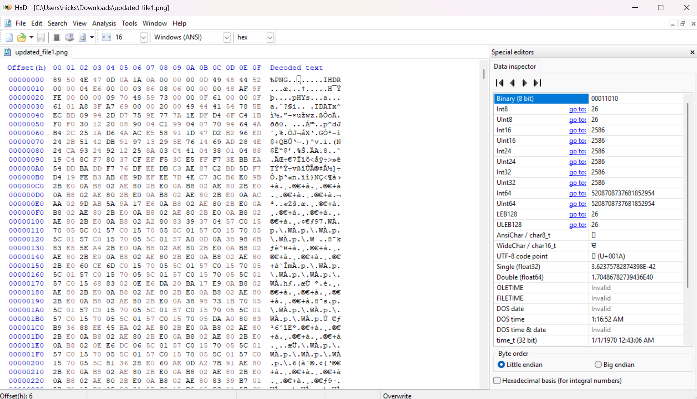
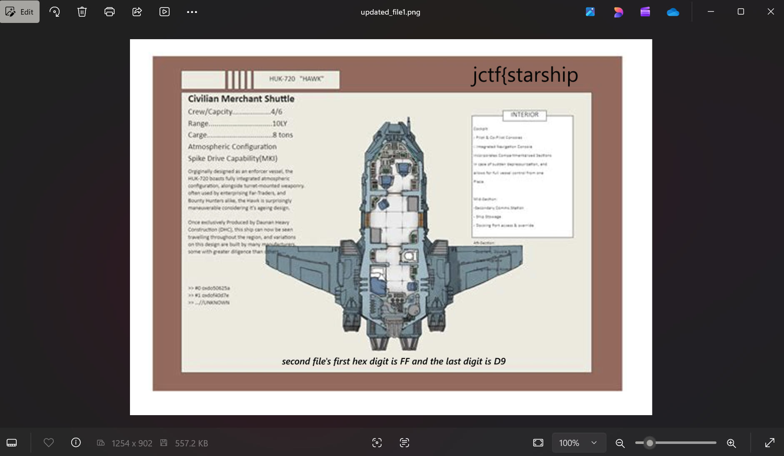
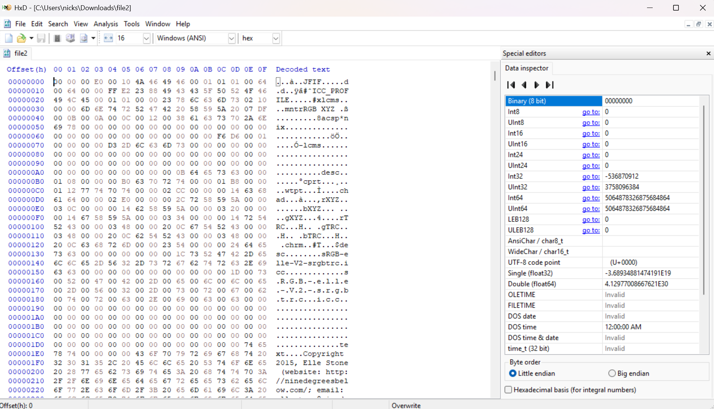
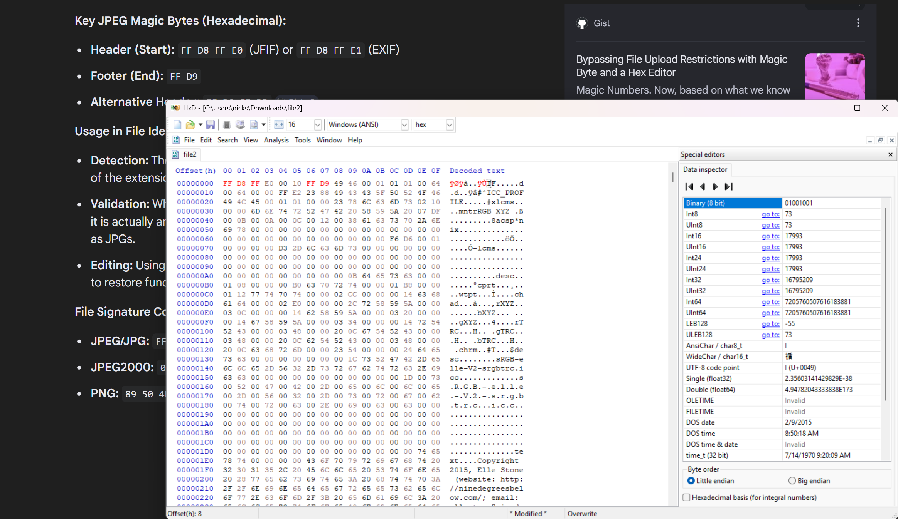
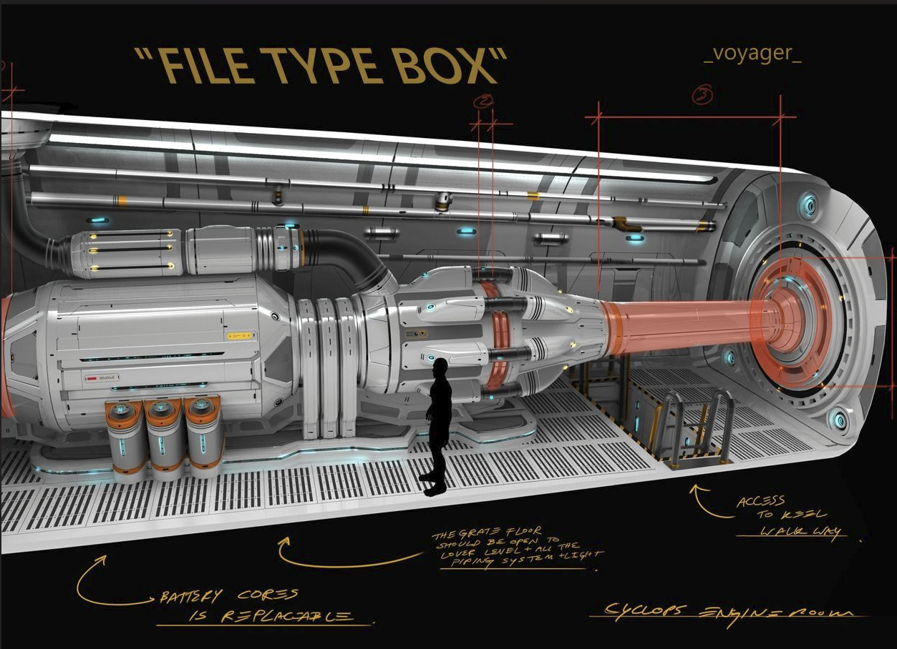
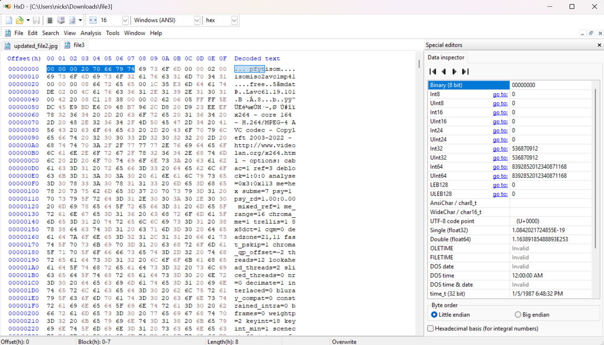
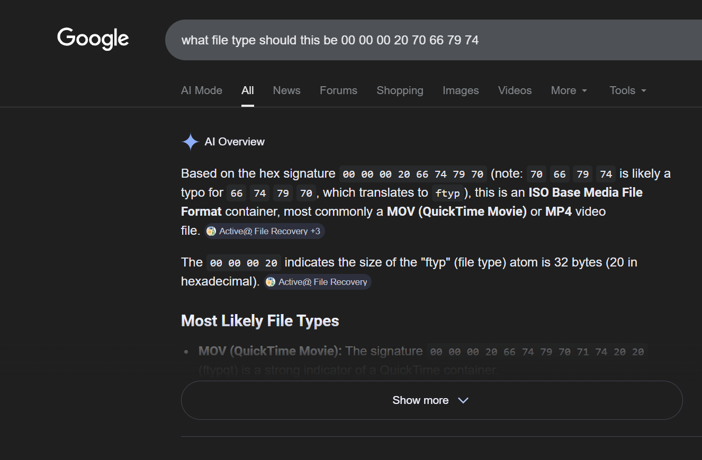
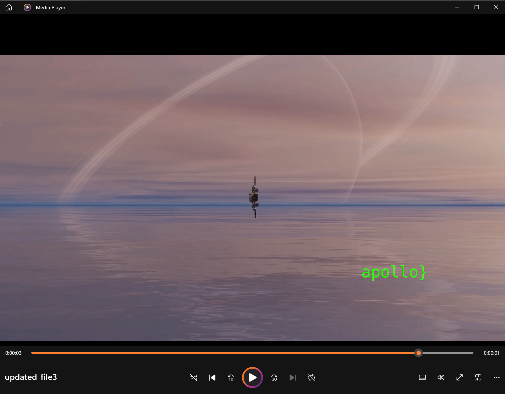

# Fix Your Ship
**Category:** Forensics | **Status:** Solved

This was extremely fun. Given three corrupted files and told the first one is a PNG. Opened each file in HxD (a hex editor -- a tool that lets you read and edit the raw binary data of any file) to inspect the magic bytes (the first few bytes of a file that identify what file type it actually is, regardless of its extension).

**File 1 (PNG):**
Corrupted header: `89 00 00 00 0D 0A 1A 0A`
Correct PNG header: `89 50 4E 47 0D 0A 1A 0A`

Fixed the four corrupted bytes, saved with a `.png` extension, and opened it. The image showed ship schematics and revealed the first piece of the flag -- `jctf{starship` -- along with a hint that the second file starts with `FF` and ends with `D9`.

**File 2 (JPEG):**
`FF` and `D9` are the start and end markers of a JPEG file. Corrupted header read: `00 00 00 E0 00 10 4A 46`.

Fixed it to `FF D8 FF E0` and changed the last two bytes to `FF D9`.

Saved with a `.jpg` extension and opened it. Second flag piece: `_voyager_`

**File 3 (MP4):**
The schematics image had a label reading "FILE TYPE BOX" -- a hint pointing at the third file's type. Opened it in HxD and found the magic bytes scrambled: `00 00 00 20 70 66 79 74`.

Did some quick googling and confirmed `70 66 79 74` as a scrambled version of `66 74 79 70` -- the `ftyp` box that identifies MP4/MOV container files.

Fixed the byte order, saved with a `.mp4` extension, and opened it. The video contained the final flag piece: `apollo}`

**Flag:** `jctf{starship_voyager_apollo}`

**What I learned:** Magic bytes are how operating systems and forensic tools actually identify file types -- not the extension. The extension is just a label anyone can change. The magic bytes are baked into the file's binary data at a specific offset and follow a standard for each format. A corrupted or misidentified file can often be repaired just by fixing those first few bytes in a hex editor. This is a fundamental forensics skill -- file carving (recovering files from raw data) works on the same principle.

**Blue team takeaway:**

File type validation should never rely on extensions alone. Any system that accepts file uploads should read the magic bytes and validate the actual file type before processing. An attacker who renames a PHP shell to `image.png` gets stopped by magic byte checking -- but not by extension checking alone.
