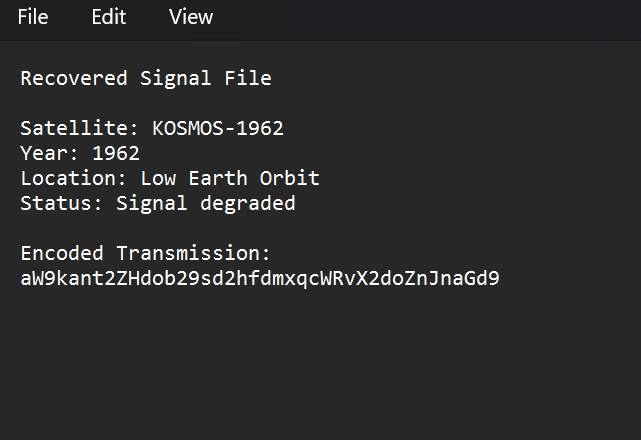
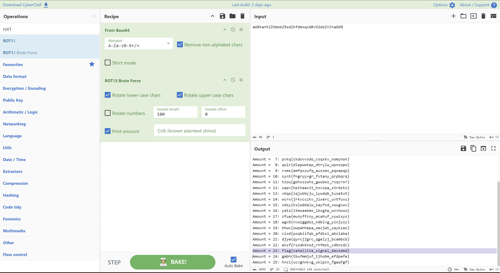

# Recovered Signal File
**Category:** Forensics | **Status:** Solved

Downloaded a raw log file and opened it in Notepad. Contents:

```
Recovered Signal File
Satellite: KOSMOS-1962
Year: 1962
Location: Low Earth Orbit
Status: Signal degraded
Encoded Transmission:
aW9kant2ZHdob29sd2hfdmxqcWRvX2doZnJnaGd9
```



Took the encoded transmission string and ran it through Base64 decode in CyberChef. Got: `iodj{vdwhoolwh_vljqdo_ghfrghg}`

The curly brace structure looked like a flag format but with shifted letters. Ran it through ROT brute force and spotted the flag in the results.



**Flag:** `flag{satellite_signal_decoded}`

**What I learned:** Base64 followed by a Caesar/ROT cipher is a classic two-layer encoding combo in CTFs. Base64 is not encryption -- it's just an encoding scheme that represents binary data as printable text. ROT is a simple letter substitution. Neither provides real security, which fits the description's note that "the encryption doesn't appear very advanced." Stacking two weak encodings doesn't make something secure -- it just adds a small extra step for anyone who knows what to look for.
