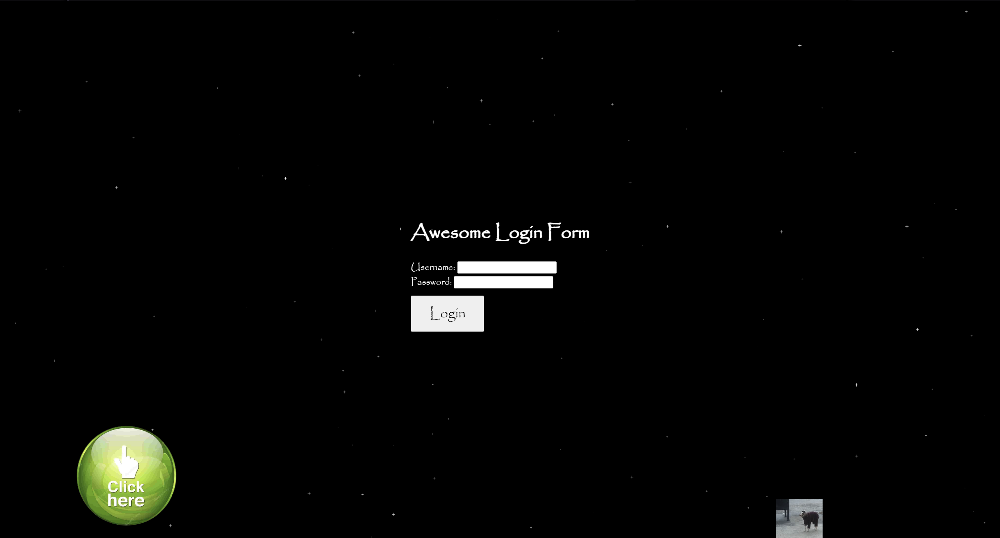
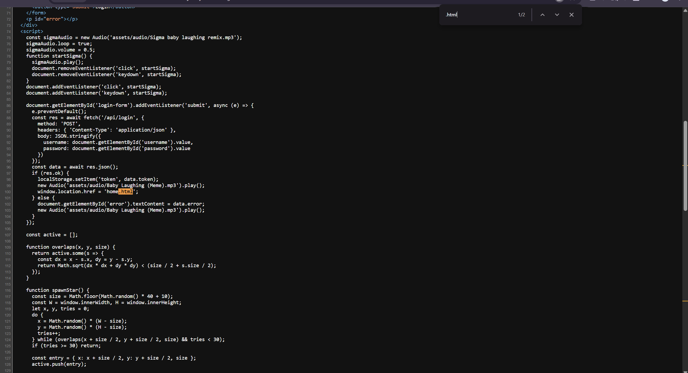
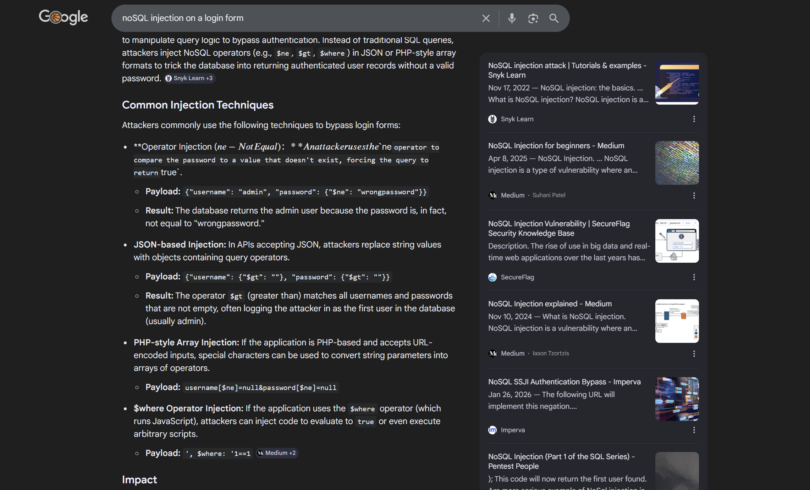
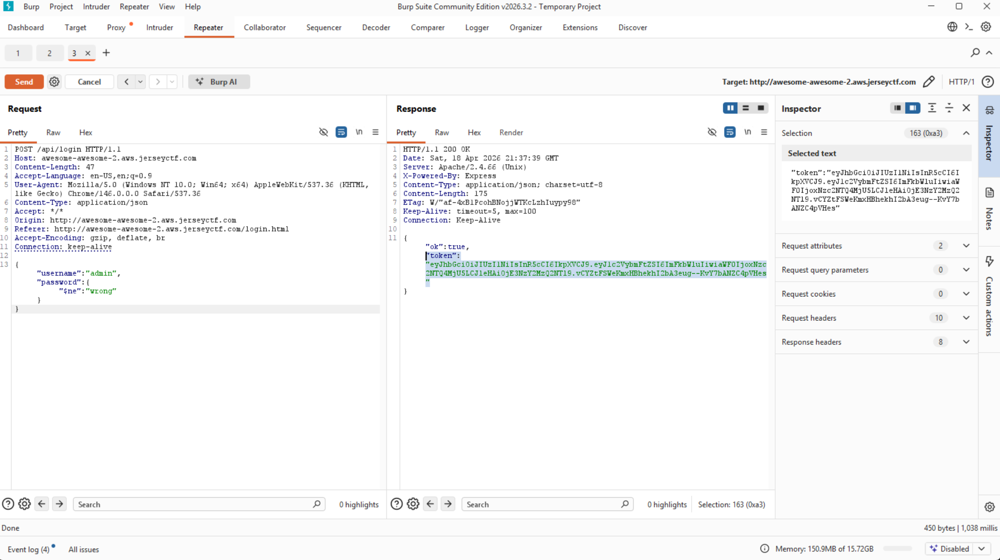

# Awesome Awesome 2
**Category:** Web Exploitation | **Status:** Solved

For starters this site is wonky. It takes you to a login form at `http://awesome-awesome-2.aws.jerseyctf.com/login.html` and it DOES have a login piece, but there's a bunch of JPEGs of cows moving around and when you click them it takes you to an HTML image of a hippo.

 The main login page just keeps adding moving JPEGs of these cows. There's a moving "click me" hand that takes you to the IMDB page of Garfield Kart. Basically this page is full of random GIFs, PNGs, and JPEGs that either appear or multiply at random intervals. The devs even said they almost didn't include it, and now I see why.

Inspected the page source and found references to `home.html` and `hipo.html`.



Navigated to both -- neither returned anything useful. Tried logging in with "username" and "password" -- nothing. Downloaded the hippo JPG to inspect for steganography (hidden data embedded inside an image file) -- something to revisit later.

Took the two free hints: one confirmed the site was running MongoDB, the other was a troll with nothing in it. No points deducted for either.



Researched MongoDB. It's a non-relational database -- where MySQL uses tables and rows to structure data, MongoDB uses JSON documents. It's something I want to get more hands-on with because I don't fully understand JSON objects and documents yet in practice. My first question after learning about it was whether it was vulnerable to injection the same way SQL is. The answer is yes, kind of. The attack is called NoSQL injection and it works on the same idea -- malformed input manipulates the database query. The difference is you can't just type the payload into the login field, because the browser sends everything typed into a form as a plain string. MongoDB needs to receive it as an actual JSON object to interpret it as an operator. The only way to do that is to intercept and modify the raw POST request in Burp Suite before it hits the server.

Googled what the modified request should look like, threw it in Burp Repeater, and changed the request body to:

```json
{"username":"admin","password":{"$ne":"wrong"}}
```

`$ne` means "not equal to" -- it tells MongoDB to find the admin user where the password is not equal to "wrong," which is always true, so it matches and logs you in. Got a 200 OK back with a token.



Googled what to do with the token. The answer was to store it in localStorage (a place the browser keeps small pieces of data per site) via the DevTools console:

```javascript
localStorage.setItem('token', 'MY_TOKEN_HERE')
```

Confirmed it saved with:

```javascript
localStorage.getItem('token')
```

Had to confirm because refreshing `login.html` wasn't doing anything visible. Tried both HTMLs from the source -- `home.html` revealed the flag.

**Flag:** `jctf{MANG0S}`

**What I learned:** NoSQL injection works on the same principle as SQL injection but with different syntax. MongoDB uses operators like `$ne` (not equal), `$gt` (greater than), and `$regex` (pattern match) inside JSON objects. The reason the payload has to go through Burp and not the form field directly is that browsers always send form input as strings -- MongoDB only interprets it as an operator if it arrives as a real JSON object, which requires editing the raw request.

This also introduced JWTs (JSON Web Tokens -- strings the server generates after login to prove who you are, split into three parts by dots). Normally the browser stores and uses these automatically on a successful login. Since the login was bypassed through Burp, it had to be set manually in localStorage.

Without the hint I may not have cracked this one. Did some bonus research into how to fingerprint a site's database without hints -- the `X-Powered-By: Express` header in the server response signals a Node.js backend, which is very commonly paired with MongoDB. Error messages from malformed input and files found through directory enumeration can also leak the database type directly.

**Blue team takeaway:**

User input going into a database query needs to be validated as the correct data type before it gets there. A password field should always arrive as a plain string -- if it arrives as a JSON object, the application should reject it outright. Libraries like `mongo-sanitize` for Node.js strip MongoDB operators out of input before the query runs. JWTs need expiration times enforced server-side and should be validated on every request.
