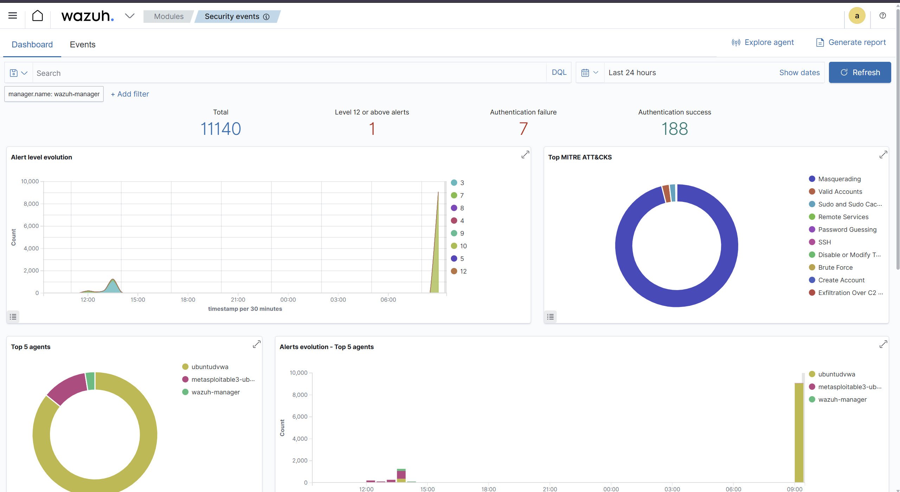
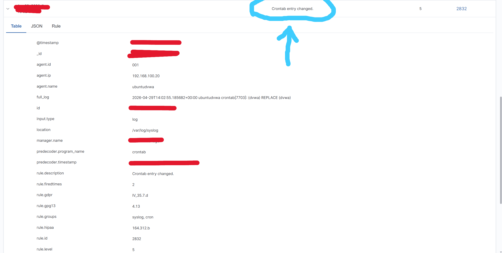
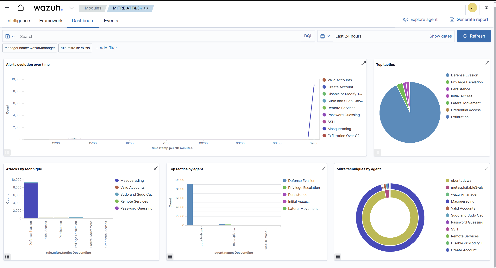

# Blue Team: Analyst Workflow

## Why Atomic Red Team Instead of Re-Running the Attack Chain

The original plan was to re-run the full red team attack chain a second time with Wazuh monitoring active, generating real detections for every step. In practice this is inefficient for testing individual detection rules. Re-running the entire chain just to verify one rule fires correctly means a lot of setup and reset for very little signal.

Atomic Red Team solves this. It is a library of small, individual attack simulations developed and maintained by Red Canary, each mapped to a specific MITRE ATT&CK technique. You pick a technique, run the test, and check whether your detection fires. If it does not, adjust the rule and try again. Exactly like a real analyst running a tabletop exercise.

Installation on the DVWA Ubuntu machine via PowerShell:

```bash
IEX (iwr 'https://raw.githubusercontent.com/redcanaryco/invoke-atomicredteam/master/install-atomicredteam.ps1' -UseBasicParsing)
Install-AtomicRedTeam -getAtomics
```

Tests were run with `-cleanup:$false` to preserve the artifacts for investigation rather than having Atomic Red Team erase them immediately after execution.

One note: T1070.004 (indicator removal via file deletion) exists in the Atomic Red Team library but was avoided. It deletes the entire Atomics folder as part of its cleanup behavior, which would have broken all subsequent tests. Good thing to know before running it.

---

## Examples of What Was Simulated

| MITRE Technique | What it does |
|---|---|
| T1057 — Process Discovery | Lists running processes, simulating an attacker doing post-access recon |
| T1053.003 — Scheduled Task/Cron | Creates a cron job, simulating persistence |
| T1136.001 — Create Local Account | Adds a new user account, simulating backdoor creation |
| T1059.004 — Unix Shell | Spawns a bash shell, simulating command execution |

---

## The Analyst Workflow

When a simulation ran, the process was:

1. Check the `hollow-purple-alerts` Slack channel for incoming alerts
2. Open the Wazuh Security Events dashboard
3. Filter by `agent.name: ubuntudvwa` and set the time window to the last 15 minutes
4. Look at the event cluster that appeared
5. Identify which rules fired, in what order, and how close together
6. Build the story


The 15-minute time window is how you cut through background noise and focus on what happened during the incident window. In a real engagement, an analyst would typically filter by device, time, and the specific alert that triggered the initial notification.



Connecting related events like these to build a timeline is called correlation. It is the core skill of a SOC analyst.

---

## DQL Reference

DQL (Dashboard Query Language) is the search syntax used in the Wazuh Security Events view. Key queries used during investigation:

| Query | What it does |
|---|---|
| `agent.name: ubuntudvwa` | Filter to the DVWA machine only |
| `rule.level >= 10` | Show only meaningful alerts |
| `rule.mitre.id: T1053.003` | Filter by specific ATT&CK technique |
| `rule.mitre.tactic: Defense Evasion` | Filter by attack tactic category |
| `agent.name: ubuntudvwa AND rule.level >= 10` | Combine agent and severity filters |
| `data.audit.command: bash` | Find events where bash was the executed command |

---

## The Key Finding: Crontab Alert

The most meaningful detection from any of the simulations was the crontab modification alert (rule 100021, mapped to T1053.003, level 12).

A cron job is a scheduled task: you tell the computer to run a specific command automatically on a repeating schedule. Legitimate cron jobs handle things like backups, software updates, and system maintenance. In the hands of an attacker who has already gotten in, a cron job is how you establish persistence. Write a cron job that re-executes your malicious code every hour, and even if someone restarts the machine, the attack comes right back.

The alert fired and appeared in the Slack channel. Filtering by `rule.id: 2832` OR `rule.mitre.id: T1053.003` in Wazuh surfaced it cleanly among the other events in the window.



What made this detection more meaningful than the others: it identified persistence behavior specifically, not just a noisy side effect. Many alerts fire because the attacker did something loud (like writing to /tmp). The crontab alert fired because the attacker was doing something with intent: trying to STAY. An analyst reading that alert knows immediately that containment is urgent, typically invoking an EDR solution to isolate this machine from the network, for starters.

Before the suppression rules for /tmp were in place, this alert was buried under 30+ /tmp noise events in the same window. Tuning those suppressions was what made this detection actionable. A detection buried in noise is not a detection.

---

## The www-data RCE Detection

Rule 100004, which detects commands executed by the www-data user, also fired during the simulations.

www-data is the user the Apache web server runs as. Apache's job is to serve web content. It should never be running arbitrary bash commands. When this rule fires, it means either the web application is executing attacker-supplied commands, or something else very wrong is happening.

This is a high-confidence, low-noise detection. The false positive rate for www-data running interactive commands is essentially zero in a normal environment, which makes it one of the more reliable rules in the set.

---

## Detection Gap: useradd via PowerShell

During the T1136.001 simulation (Create Local Account), an interesting gap appeared. Atomic Red Team runs its simulations through PowerShell. When PowerShell called `useradd` as a subprocess, rule 100022 (new user account created, level 13) did NOT fire.

When the same `useradd` command was run directly from a bash shell, the rule fired immediately.

The reason: auditd logs the process differently depending on the parent process. When bash runs `useradd`, the execve syscall is logged with bash as the parent and the auditd key label matches the rule's expected pattern. When PowerShell runs `useradd`, the syscall path is different and did not match. The detection gap is real. Fixing it would require a rule adjustment that accounts for PowerShell as a parent process.

This is exactly what red and blue team exercises exist to find. A rule that looks correct in isolation can miss a technique depending on how the attacker invokes it.

---

## Key Findings

| Finding | Impact |
|---|---|
| Crontab alert buried in /tmp noise | Required multiple suppression rules before it was actionable. Demonstrated that tuning is as important as rule writing. |
| www-data command execution is a reliable RCE indicator | High confidence, low false positive rate once baselined. |
| useradd via PowerShell bypassed rule 100022 | Real detection gap. Parent process context matters for auditd-based rules. |
| Event clusters tell the story | One alert is noise. Three alerts from the same machine in the same second is an incident. |



---

## What Comes Next: Incident Response

Once you have correlated the events and identified an incident, every response follows the same structure: the Incident Response Lifecycle.

**CONTAIN.** Stop the bleeding first. Isolate the affected machine from the rest of the network immediately. Keep it running so you can investigate, but make sure nothing can spread from it.

**ERADICATE.** Figure out everything the attacker did and undo all of it. Remove the malicious cron job. Delete any files they dropped. Close whatever door they used to get in initially. This step requires confidence that you found everything, which is why the investigation phase matters so much.

**RECOVER.** Restore the machine to a clean state. This might mean restoring from a known good backup, patching the vulnerability that was exploited, or in severe cases rebuilding from scratch. The method depends on how deeply the attacker got in and how confident you are that you found everything.

**DOCUMENT.** Write a full incident report: what happened, when, how the attacker got in, what they did, and most importantly what needs to change so it cannot happen the same way again. This is called root cause analysis, and the remediation recommendations that come out of it are what actually make an organization more secure over time. The report is also legal documentation if the incident escalates beyond internal handling.

Connecting related events to build a timeline, understanding what each event means, and knowing what to do next is the core skill of a SOC analyst. These simulations were reps at exactly that.

---

[Back to Overview](overview.md) | [Back to Detection Engineering](detection-engineering.md)
