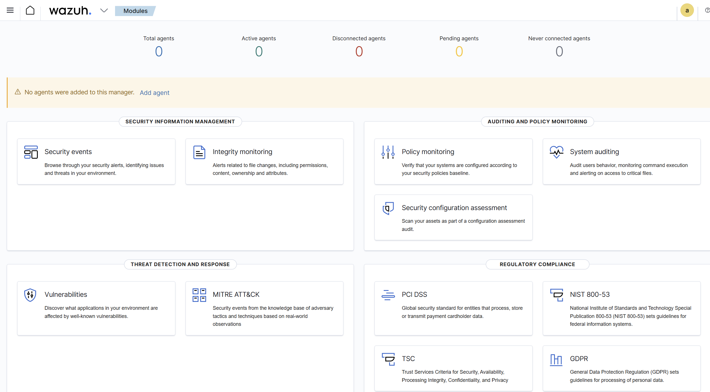
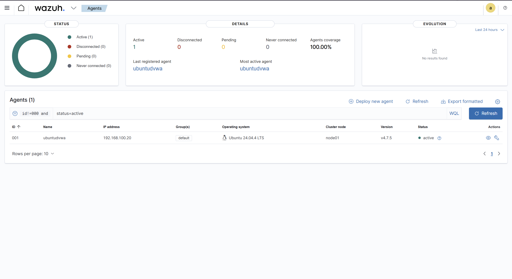
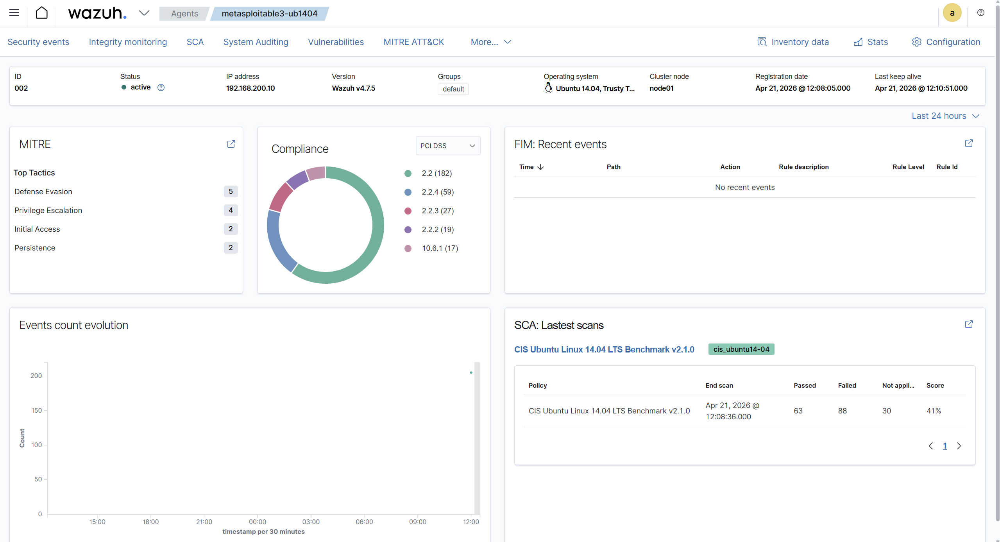
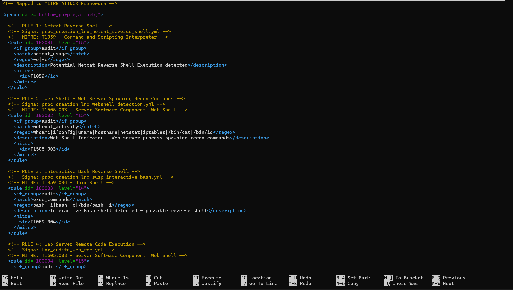
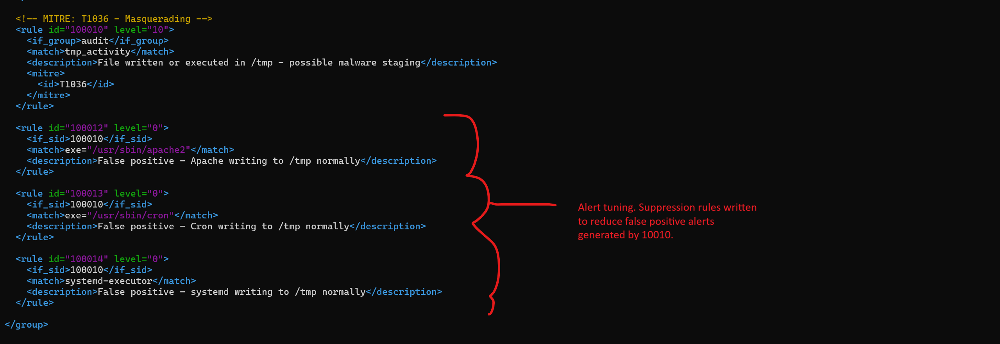
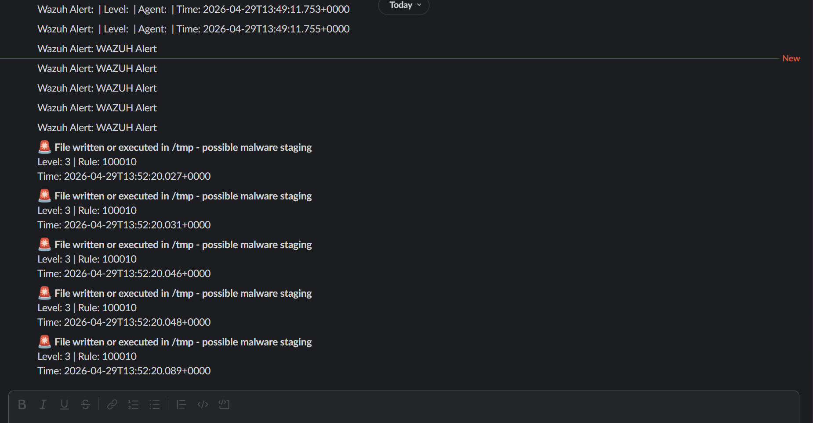
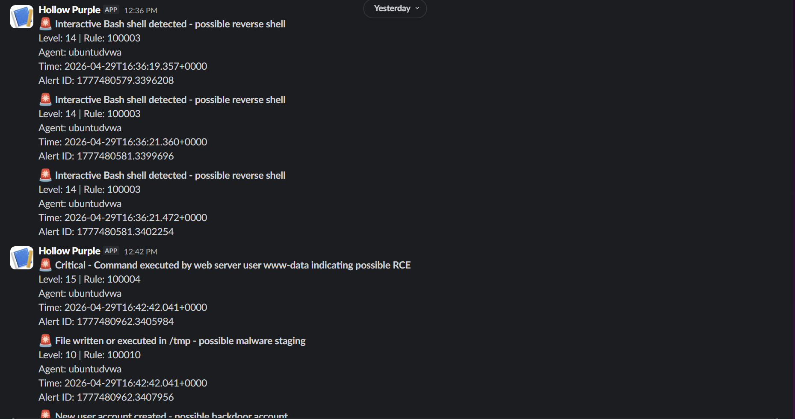

# Blue Team: Detection Engineering

## Why Wazuh

The original plan for this lab used Splunk as the SIEM. I did attempt this entire blue team portion with Splunk, and then with Wazuh; I found Wazuh much easier to configure and use, so I spent more time on it and only included my time spent on Wazuh instead of Splunk. Wazuh is free, open source, and purpose-built for security monitoring. It combines a SIEM with EDR (Endpoint Detection and Response), runs its own detection logic natively, and integrates with Shuffler cleanly. Swapping to Wazuh also meant getting kernel-level visibility through auditd integration, which turned out to be critical for catching the kinds of events this lab generates.

---

## Wazuh Manager Setup

A fresh Ubuntu 22.04 VM was built with the following specs: 4GB RAM, 2 vCPUs, 30GB disk, three network adapters.

Wazuh was installed using the official all-in-one installer script, which deployed the manager, indexer, and dashboard on the same machine:

```bash
curl -sO https://packages.wazuh.com/4.7/wazuh-install.sh
sudo bash wazuh-install.sh -a
```

Cloud-init was disabled to prevent it from overwriting the static IP configuration on reboot:

```bash
sudo bash -c "echo 'network: {config: disabled}' > /etc/cloud/cloud.cfg.d/99-disable-network-config.cfg"
```

The two static IPs (ens37 and ens38) were configured in `/etc/netplan/50-cloud-init.yaml`. The ens33 interface uses DHCP and gets `192.168.78.137` from the VMware host network. That is the address used to access the dashboard from the Windows host.



---

## Agent Deployment

Wazuh agent version 4.7.5 was installed on both DVWA and Metasploitable3.

**DVWA (Ubuntu 24.04):** standard install using `apt`, configured to connect to the manager at `192.168.100.70` via `/var/ossec/etc/ossec.conf`, started with `systemctl`.

**Metasploitable3 (Ubuntu 14.04):** installed via `.deb` package directly due to the older OS. Started with `service` instead of `systemctl` because Ubuntu 14.04 predates systemd.

Both agents confirmed active in the dashboard:
- Agent 001: `ubuntudvwa` at `192.168.100.20`
- Agent 002: `metasploitable3-ub1404` at `192.168.200.10`

Connection confirmed in agent logs on both machines:
```
wazuh-agentd: INFO: (4102): Connected to the server ([192.168.100.70]:1514/tcp)
```





---

## Auditd Setup

Auditd (the Linux Audit Daemon) records system activity at the kernel level. Without it, Wazuh only sees what ends up in syslog and auth.log. With it, it sees every command executed, every file read or written, every network connection opened, every privilege change. It's what I need turned on for maximum visibility.

Installed on both machines:

**DVWA:**
```bash
sudo apt install auditd audispd-plugins -y
sudo systemctl enable auditd && sudo systemctl start auditd
```

**Metasploitable3:**
```bash
sudo apt-get install auditd audispd-plugins -y
sudo service auditd start
```

To get Wazuh to read auditd output, the following block was added to `/var/ossec/etc/ossec.conf` on both agents, just before the closing `</ossec_config>` tag:

```xml
<localfile>
  <log_format>audit</log_format>
  <location>/var/log/audit/audit.log</location>
</localfile>
```

Custom audit rules were written for both machines and deployed to `/etc/audit/rules.d/hollow-purple.rules`. On Metasploitable3 they were also copied to `/etc/audit/audit.rules` to ensure persistence on the older OS. The rules cover:

| Category | Key | What it catches |
|---|---|---|
| Command execution | exec_commands | Every command run via execve syscall |
| Network connections | network_connect | All outbound connections including reverse shells |
| Identity file changes | identity | Modifications to /etc/passwd, /etc/shadow, /etc/group |
| Sudo and privilege escalation | actions | Any sudo usage and sudoers file changes |
| pkexec monitoring | maybe-escalation | Execution of pkexec binary (PwnKit) |
| Temp directory activity | tmp_activity | Files written or executed in /tmp, /var/tmp, /dev/shm |
| Web root activity | webroot_activity | Files written or executed in /var/www |
| Known attack tools | netcat_usage | Execution of nc, netcat, ncat binaries |
| Shell execution | bash_usage | Direct execution of /bin/bash |
| Interpreter usage | interpreter_usage | Python and Perl execution |
| SSH config changes | sshd_config | Modifications to SSH configuration |
| Cron changes | cron | New or modified cron jobs |
| Permission changes | perm_mod | chmod and chown usage |

DVWA runs 43 active audit rules. Metasploitable3 runs 41. Two fewer because Ubuntu 14.04's older kernel does not support the `connect` syscall directly, so network connection monitoring on Metasploitable3 relies on execve catching netcat and other tools instead.

---

## Sigma as Reference

Sigma is a vendor-agnostic detection rule format maintained by the security community. Write the detection logic once, translate it to whatever SIEM you are running. There is a Python tool called `sigmac` that automates translation to formats like Wazuh XML, but it had compatibility issues with the Python version in the lab environment. The relevant rules were translated to Wazuh XML manually.

Seven Linux-specific Sigma rules from the SigmaHQ repository were used as references:

- `proc_creation_lnx_webshell_detection.yml`
- `proc_creation_lnx_netcat_reverse_shell.yml`
- `proc_creation_lnx_susp_interactive_bash.yml`
- `lnx_auditd_web_rce.yml`
- `lnx_auditd_susp_c2_commands.yml`
- `lnx_shell_susp_rev_shells.yml`
- `lnx_auditd_data_exfil_wget.yml`

These were translated into Wazuh XML rules using the `<field name="audit.key">` format, which matches against the audit key label assigned by auditd rules. One additional custom rule was written for PwnKit (CVE-2021-4034) since no Sigma rule exists for that specific technique.

---

## Custom Detection Rules

All rules live in `/var/ossec/etc/rules/local_rules.xml` on the Wazuh manager. Level 10 is the threshold for Shuffler notification. Level 15 is the highest available severity.

| Rule ID | What it detects | MITRE | Level |
|---|---|---|---|
| 100001 | Netcat reverse shell execution | T1059 | 15 |
| 100002 | Web shell recon commands in web root | T1505.003 | 15 |
| 100003 | Interactive bash shell spawned | T1059.004 | 14 |
| 100004 | Command executed by www-data user (RCE indicator) | T1505.003 | 15 |
| 100005 | Suspicious C2 tool execution | T1071 | 12 |
| 100006 | Reverse shell command strings using /dev/tcp | T1059.004 | 15 |
| 100007 | Curl or wget execution (exfiltration or tool download) | T1041 | 12 |
| 100008 | PwnKit pkexec execution | T1548 | 15 |
| 100009 | SSH execution on monitored endpoint | T1021.004 | 12 |
| 100010 | File written or executed in /tmp | T1036 | 10 |
| 100021 | Crontab modified (persistence) | T1053.003 | 12 |
| 100022 | New user account created (backdoor) | T1136.001 | 13 |
| 100024 | SSH brute force attempt | T1110 | 12 |
| 100025 | Rootkit detection | T1014 | 15 |
| 100026 | Sudo to root on monitored endpoint | T1548.003 | 12 |

Rules 100021 and 100022 are bump rules. Wazuh ships with built-in rules for crontab changes (rule 2832) and new user creation (rule 5902), but they fire at low severity levels that fall below the Shuffler notification threshold. The bump rules fire on the same underlying events and escalate them to levels 12 and 13 so they actually generate alerts.

Rules use Wazuh's `<field name="audit.key">` matching against the key labels assigned in the auditd rules. Example rule structure:

```xml
<rule id="100003" level="14">
  <if_sid>80700</if_sid>
  <field name="audit.key">bash_usage</field>
  <description>Interactive bash shell spawned on monitored endpoint</description>
  <mitre>
    <id>T1059.004</id>
  </mitre>
</rule>
```



---

## Suppression Rules

The noisiest rule out of the gate was 100010 (file activity in /tmp). It is a valid detection: attackers love /tmp because any user can read and write there without special permissions. But the OS uses /tmp constantly for legitimate reasons too, and without suppression, every routine system process generated an alert.

Suppression rules written to silence legitimate behavior:

| What was suppressed | Why |
|---|---|
| Wazuh's own ps health check | The manager runs ps regularly to verify agent status |
| Admin SSH sessions from the Windows host | My own SSH sessions into the lab machines |
| PAM session noise on the manager itself | Normal login and logout events on the Wazuh VM |
| PowerShell writing to /tmp during Atomic Red Team runs | Atomic Red Team uses PowerShell to stage payloads; those writes are expected test artifacts |
| rm deletions by the dvwa user in /tmp during testing | Cleanup behavior from test runs |
| Apache, cron, and systemd writing to /tmp | OS processes that legitimately and regularly use /tmp |
| Atomic Red Team execution log file | Atomic Red Team writes its own log to /tmp as part of normal operation |

Each suppression rule is as narrow as possible: matching on specific process names, specific users, or specific file paths rather than broadly silencing the entire /tmp detection category. The goal is to keep rule 100010 sensitive to actual malicious /tmp usage while eliminating the noise that made it unusable before tuning.

This process mirrors what a real SOC analyst does: a rule fires, you investigate the raw log, identify the legitimate process causing the false positive, write a targeted suppression rule, and verify the noise stops. Repeat until the rule is reliable.



Before those suppressions were written, this is what the Shuffler notification queue looked like: the same /tmp alert firing over and over within the same second, drowning out everything else.



---

## SOAR: Shuffler Integration

Shuffler.io is the SOAR platform. It receives Wazuh alerts automatically via webhook and executes a workflow that sends a formatted Slack message to `hollow-purple-alerts`.

Wazuh has a built-in process called `integratord` that monitors for alerts above a configured severity threshold and POSTs them as JSON to an external URL. Shuffler provides the webhook URL that receives that JSON and triggers the workflow. In the Shuffler workflow, an HTTP node receives the webhook payload and a Slack node sends the notification.

Integration config added to `/var/ossec/etc/ossec.conf` on the Wazuh manager:

```xml
<integration>
  <name>shuffle</name>
  <hook_url>https://shuffler.io/api/v1/hooks/webhook_[id]</hook_url>
  <level>10</level>
  <alert_format>json</alert_format>
</integration>
```

This tells Wazuh to POST every alert at level 10 or above to Shuffler in JSON format. Level 10 was chosen to exclude informational noise and focus on meaningful detections. No automated response beyond notification was configured: this lab was about detection and investigation, not automated remediation.



---

## Microsoft Sentinel (Attempted)

Microsoft Sentinel was considered early in the blue team planning. A Sentinel workspace was created in Azure, and data ingestion was confirmed working manually by POSTing Wazuh alert data to the Log Analytics workspace.

Live automated forwarding was not completed. Microsoft deprecated the HTTP Data Collector API that would have made this straightforward. The current replacement requires installing the Azure Arc agent on each monitored endpoint, which adds significant infrastructure complexity. Combined with Microsoft's ongoing Defender migration, Sentinel was dropped in favor of Shuffler. Shuffler was simpler to integrate, free, and a better fit for a self-contained lab environment anyway.

---

Next: [Analyst Workflow](analyst-workflow.md)

[Back to Overview](overview.md)
