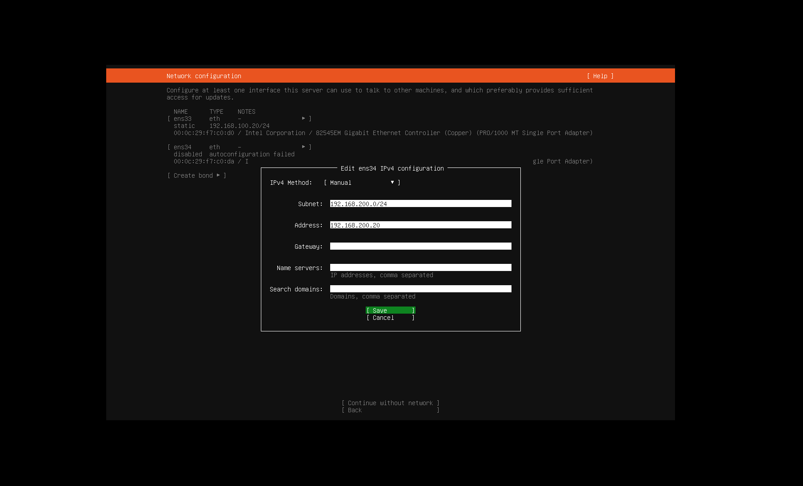
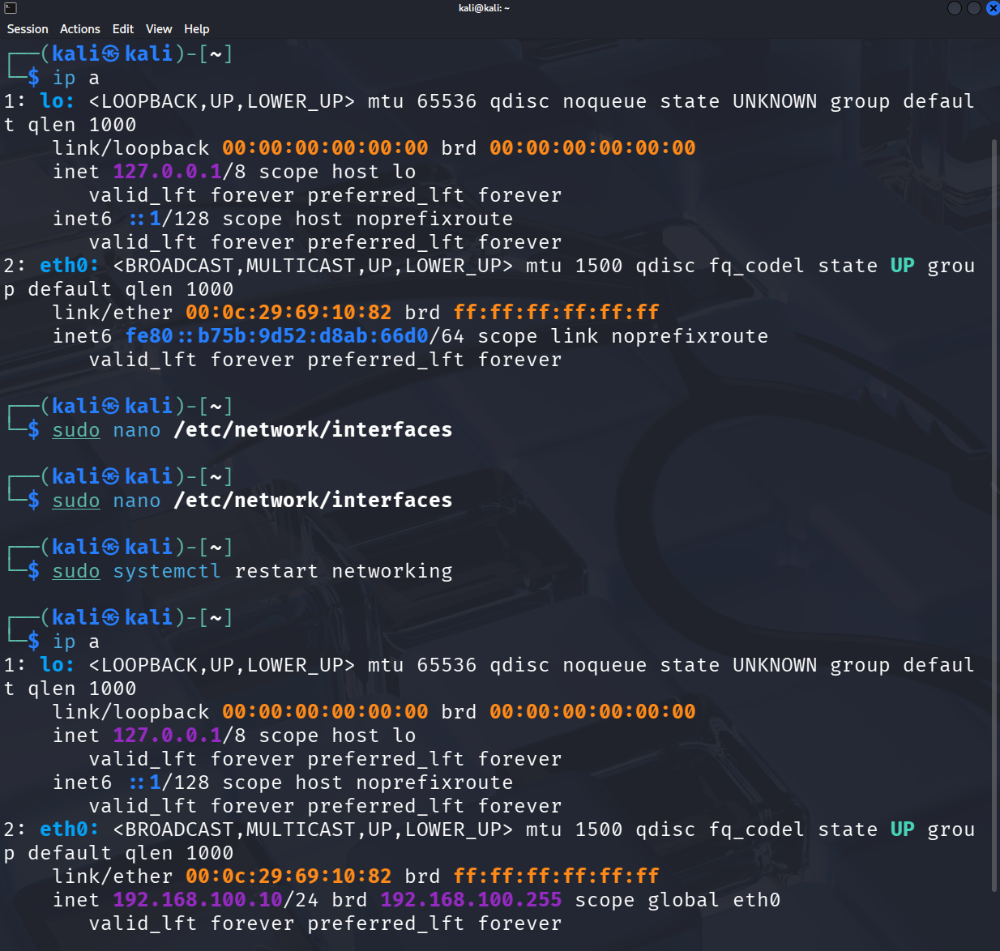
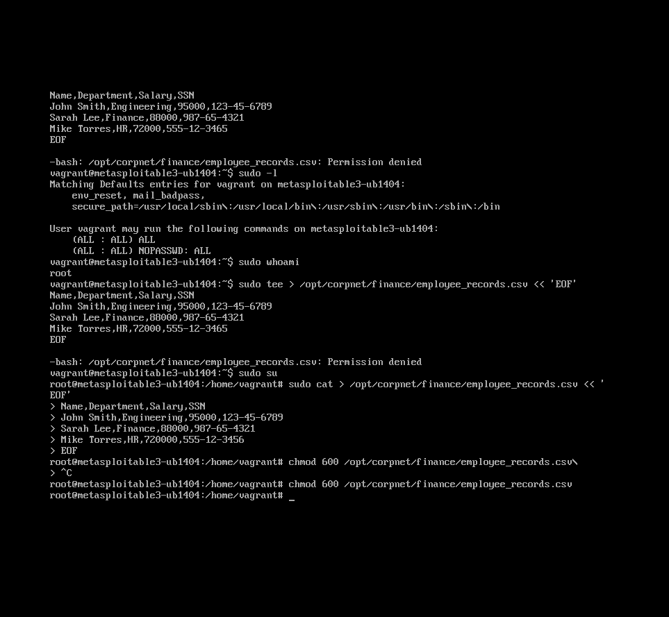

# Part 0: Lab Setup

**Goal:** Build an isolated 4-VM lab that forces realistic lateral movement.

---

## Architecture

Two isolated virtual networks in VMware Workstation:
- **VMnet1 (DMZ — 192.168.100.x):** Kali, Ubuntu/DVWA, Wazuh manager
- **VMnet2 (Internal — 192.168.200.x):** Metasploitable3, Ubuntu's second NIC, Wazuh manager

Host-only mode. The VMs can only reach each other, no internet access.

---

## Kali

Static IP `192.168.100.10` assigned via `/etc/network/interfaces`. After editing and restarting networking with `sudo systemctl restart networking`, `ip a` confirmed `eth0` picked up the address.



---

## Ubuntu + DVWA

DVWA (Damn Vulnerable Web App) is a deliberately broken web application used for practice. It runs on Apache + PHP + MySQL.

### Problems hit and fixed

**apt couldn't install packages**

Ubuntu was on a host-only network with no internet access. `apt` silently skipped MySQL because it couldn't reach the package repositories.

Fix: added a temporary NAT adapter (routes VM traffic through the host machine's internet connection), installed packages, then removed it.

**NAT adapter had no IP**

The VM had the adapter but Ubuntu's network config (netplan) didn't know about it, so it ignored it.

Fix: edited `/etc/netplan/*.yaml` to add the adapter with `dhcp4: true`, ran `sudo netplan apply`. This told Ubuntu to request an IP automatically via DHCP when it sees that adapter.

**DVWA setup page returned HTTP 500**

500 means the server hit an error it couldn't handle. After ruling out MySQL connectivity and PHP issues, the fix was changing `db_server` in DVWA's config from `localhost` to `127.0.0.1`. The difference: `localhost` tells PHP to connect via a Unix socket, but MySQL's socket path didn't match. `127.0.0.1` forces a TCP connection instead, which worked.

Ubuntu's second NIC (`ens34`) was manually configured with a static address on the 192.168.200.x subnet, making it dual-homed: one foot in the DMZ (shared with Kali), one in the internal network (shared with Metasploitable3).



---

## Metasploitable3

A deliberately vulnerable VM from Rapid7 simulating a neglected internal server. It runs Ubuntu 14.04 with outdated and misconfigured services: Samba for file sharing, ProFTPD, a payroll web application, and others.

Built using **Vagrant** (Infrastructure as Code): instead of manually clicking through setup, a `Vagrantfile` describes exactly what to build and Vagrant builds it automatically, identically every time. Same philosophy as Terraform (cloud infra), Ansible (server config), and Docker (containers). This was first practical experience with IaC, and the main advantage is speed and reduction of human error.

Setup:
```bash
vagrant up --provider=vmware_desktop
```

Static IP `192.168.200.10` assigned in `/etc/network/interfaces`. Fake sensitive data planted at `/opt/corpnet/finance/employee_records.csv`: fake employee names, salaries, and SSNs. This is the target file for Part 5.

Planting required `sudo su` to write as root. The file was then set to `chmod 600` (root read-only) to simulate a realistic permissions boundary an attacker would have to work around.



---

## SIEM

The original SIEM for this lab was Splunk. It was replaced by Wazuh (a free open source SIEM and EDR platform) for the blue team phase. The Wazuh setup, agent deployment, and detection rule configuration are all covered in [Detection Engineering](../blue-team/detection-engineering.md).

---

## Key Takeaways

- **Networks don't configure themselves.** Even in a 4-VM lab, routing between subnets requires explicit config. IP forwarding, static routes, and gateway settings all have to be right or traffic silently goes nowhere.
- **Protocols vs. applications.** HTTP, SMB, TCP are standards: documents defining how communication should work. Apache, Samba, and other software are what actually implement them. This distinction makes troubleshooting significantly easier.
- **IaC is everywhere.** Vagrant, Terraform, Ansible, Docker all solve the same problem from different angles: replace manual, inconsistent human config with reproducible code.
- **Static routes don't persist by default.** `ip route add` is temporary and only lasts until reboot. To make routing permanent it has to live in netplan or `/etc/network/interfaces`.

---

Next: [Part 1: Recon](part1-recon.md)
