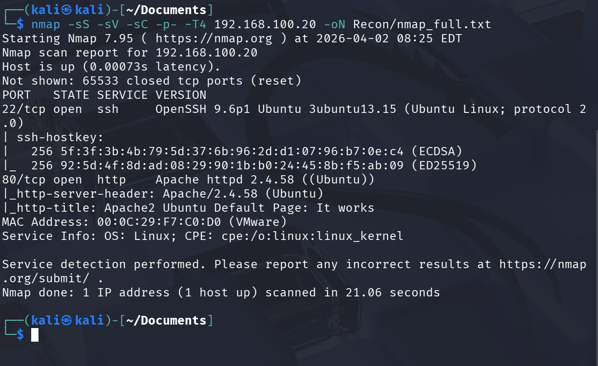
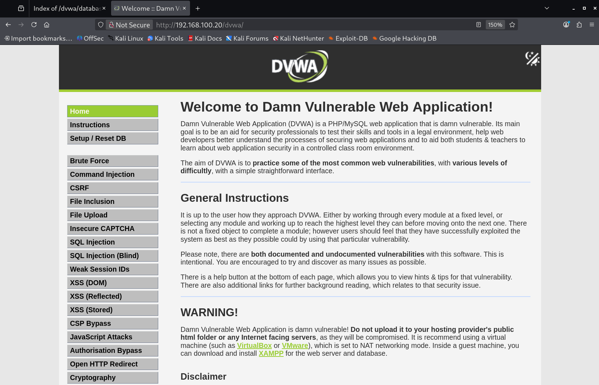
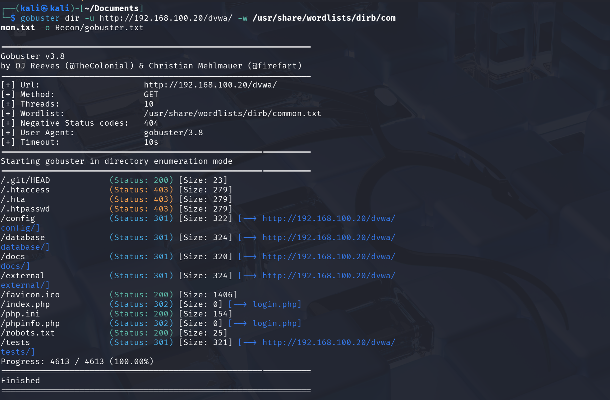
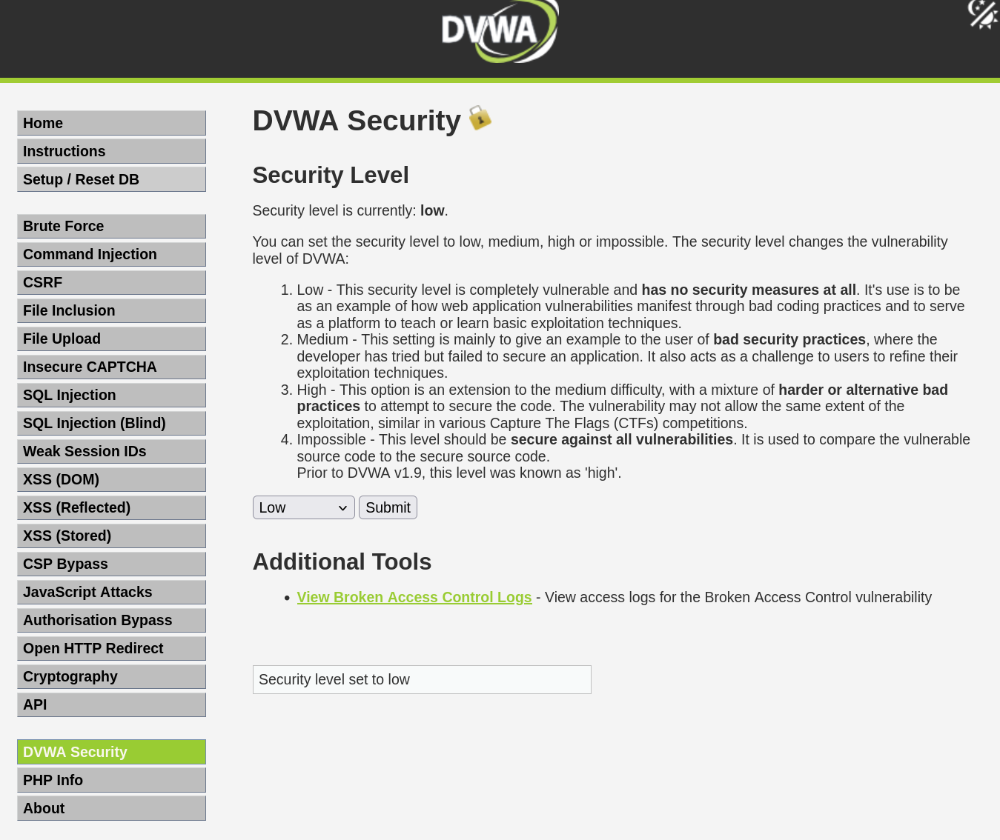

# Part 1: Recon

*MITRE ATT&CK: T1046 Network Service Discovery, T1595 Active Scanning*

**Goal:** Map the DMZ network from the attacker's perspective. Find live hosts, open ports, running services, and software versions. A real attacker would emphasize staying quiet, but for this purple team project a little noise is intentional: the blue team needs something to detect.

---

## Host Discovery

```bash
nmap -sn 192.168.100.0/24
```

**Hosts found:**

| IP | Hostname | Notes |
|---|---|---|
| 192.168.100.20 | ubuntu-dvwa | Apache + SSH |

---

## Port and Service Enumeration

Full port scan with version detection and default scripts, output saved for reference:

```bash
nmap -sS -sV -sC -p- -T4 192.168.100.20 -oN Recon/nmap_full.txt
```

Flag breakdown:
- `-sS` — SYN (stealth) scan. Sends the first packet of a TCP handshake but never completes it. Stealthier than a full connect scan because it never establishes a full session.
- `-sV` — detect the exact version of each service. Not just "SSH" but "OpenSSH 9.6p1." Version numbers make CVE research much faster.
- `-sC` — run nmap's default scripts. These automatically check for common misconfigurations and grab banners, HTTP headers, SSH key info, etc.
- `-p-` — scan all 65,535 ports. The default nmap scan only covers the top 1,000. Services can hide on high ports.
- `-T4` — aggressive timing. Sends packets faster, shortening scan time but generating more noise. In a real engagement you might use `-T2` or `-T3` to stay under IDS radar. Here the noise is intentional.
- `-oN` — save output to a file. Best practice to save raw output for reference later.



**Key findings:**

| Host | Port | Service | Version | Notes |
|---|---|---|---|---|
| .100.20 | 22 | SSH | OpenSSH 9.6p1 | Ubuntu Linux |
| .100.20 | 80 | HTTP | Apache 2.4.58 | Ubuntu default page at `/`, DVWA at `/dvwa/` |

Only two open ports. Port 3306 (MySQL) was not visible because MySQL is bound to `127.0.0.1` (localhost only): it accepts connections from the machine itself but refuses external connections entirely. nmap only sees what is exposed to the network. The full picture of what is running locally only becomes visible once the machine is compromised.

---

## Web Application Enumeration

Navigating to `http://192.168.100.20/dvwa/` confirmed DVWA was running. Default credentials `admin / password` granted access.



Directory brute force to map the application structure and find web-accessible upload paths:

```bash
gobuster dir -u http://192.168.100.20/dvwa/ -w /usr/share/wordlists/dirb/common.txt -o Recon/gobuster.txt
```

Flag breakdown:
- `dir` — directory and file brute-forcing mode. Gobuster also has `dns` (subdomain enumeration) and `vhost` modes.
- `-u` — target URL.
- `-w` — wordlist. Gobuster tries each name in the list against the target. If the server responds with anything other than a 404, it gets reported as found.
- `-o` — save output to a file.

A note on the target URL: the scan ran directly against `/dvwa/` because the application was already known from setup. In a real engagement you would not know this upfront. The correct approach would be to run Gobuster against the root URL first, discover `/dvwa/` as a result, and then enumerate inside it. This lab skips that step.



**Key findings:**

| Path | Status | Notes |
|---|---|---|
| `/.git/HEAD` | 200 | Exposed git repository — critical finding |
| `/.htaccess` | 403 | Exists but blocked |
| `/config` | 301 | App config directory |
| `/database` | 301 | Contains SQL files and database schema |
| `/php.ini` | 200 | PHP config file exposed and readable |
| `/robots.txt` | 200 | Standard exclusion file |

The most significant finding: `/.git/HEAD` returned 200. An exposed `.git` directory means the entire version history of the codebase is accessible from the web. An attacker can reconstruct full source code, find hardcoded credentials, recover deleted sensitive files from old commits, and map the application's logic in detail. Not the chosen attack vector here, but it would be flagged as critical in any professional pentest report.

`/php.ini` being readable revealed that `allow_url_include` is set to `On`, a dangerous misconfiguration confirming PHP file inclusion attacks would be possible.

Security level was set to Low before exploitation:



**DVWA attack surface summary:** file upload at `/dvwa/vulnerabilities/upload/`, upload directory web-accessible at `/dvwa/hackable/uploads/`. Both conditions needed for the next part are confirmed: the application accepts arbitrary file uploads, and the server executes PHP in uploaded files.

---

## Key Takeaways

- **Version disclosure is a liability.** Apache and OpenSSH both returned exact version strings in nmap output. Enough to look up known CVEs immediately.
- **Directory brute force is loud.** Hundreds of 4xx responses from one IP in seconds is trivially detectable, but only if someone is watching.
- **MySQL bound to localhost is invisible externally.** Services that only listen on 127.0.0.1 do not appear in external scans. The full internal picture only emerges after gaining access.

---

[Part 0: Lab Setup](part0-setup.md) | Next: [Part 2: Initial Access](part2-initial-access.md)
