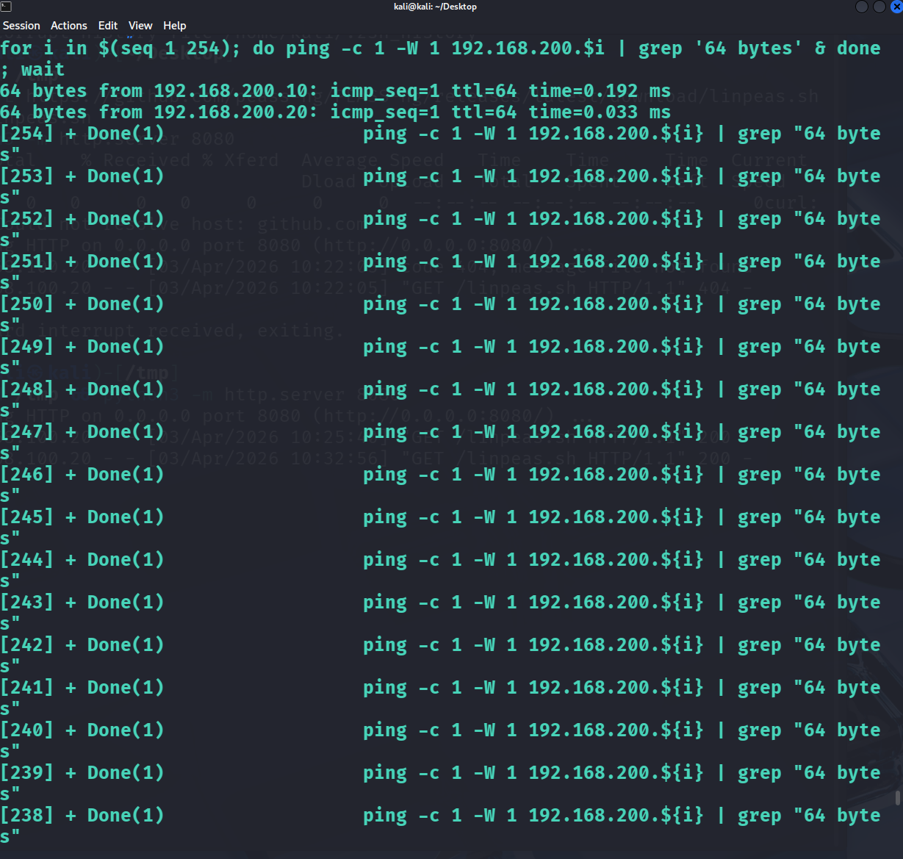
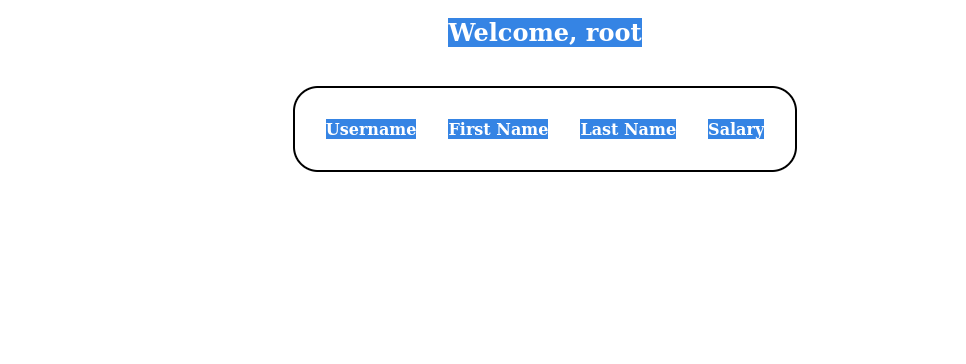
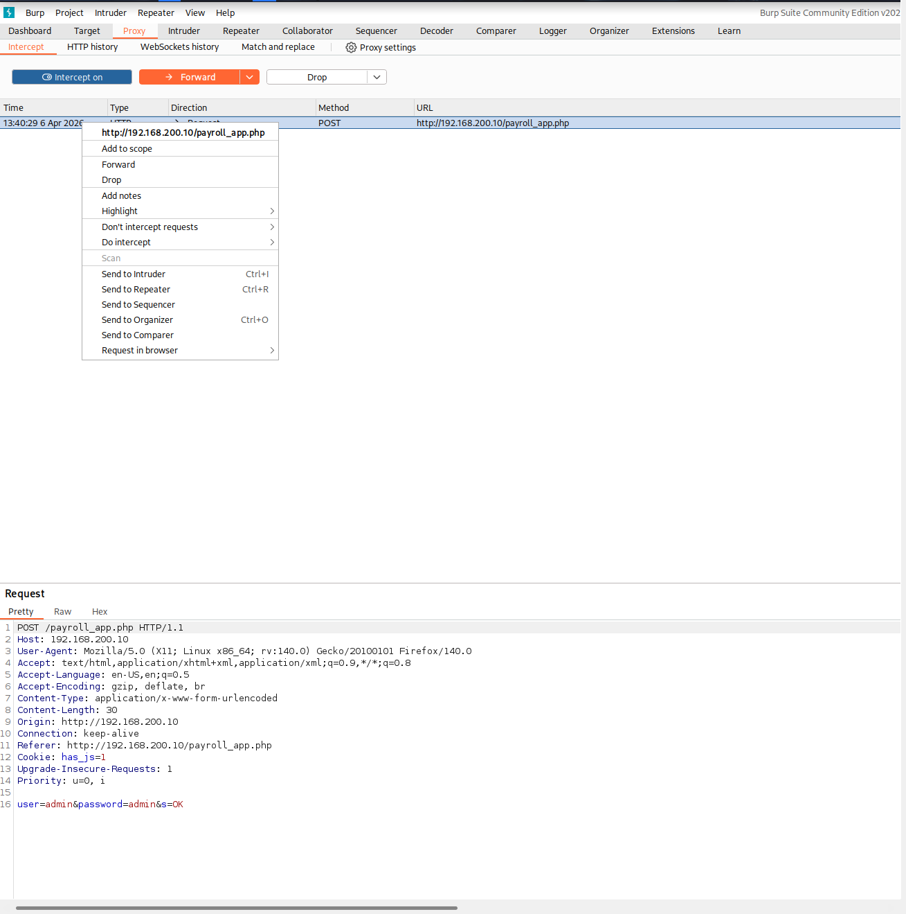
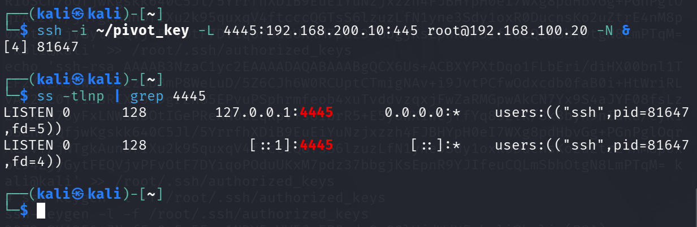
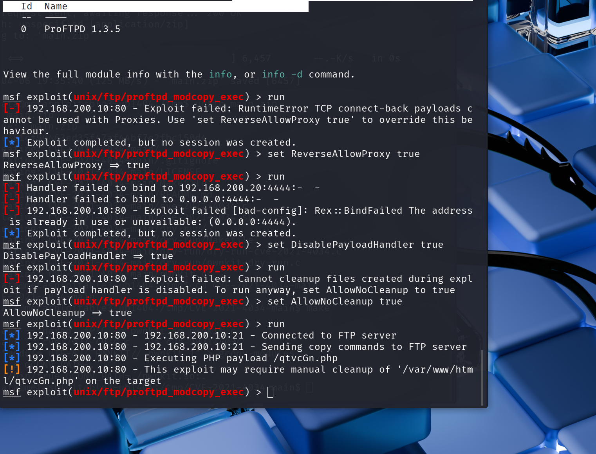
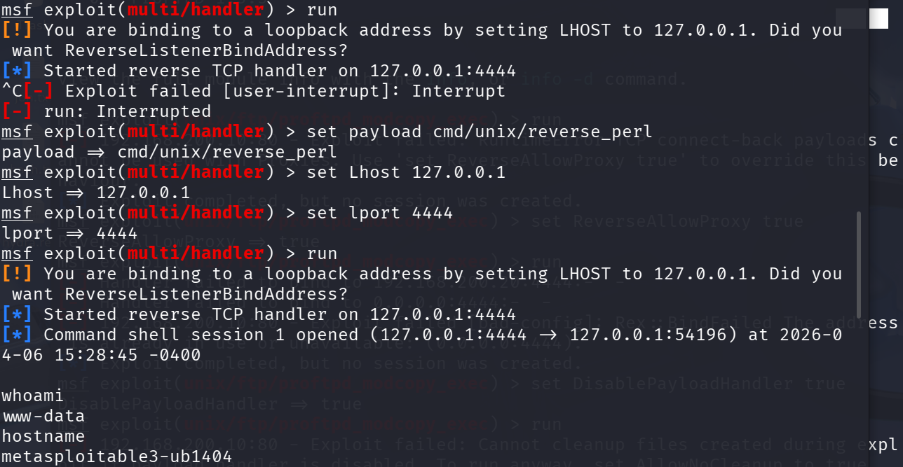
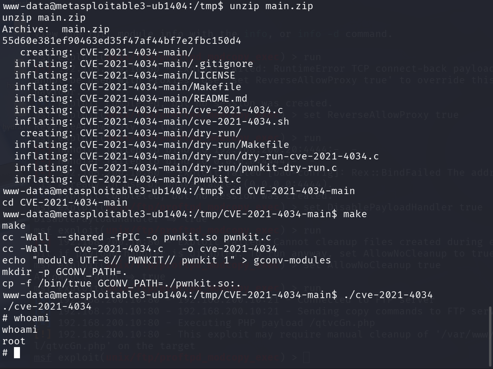
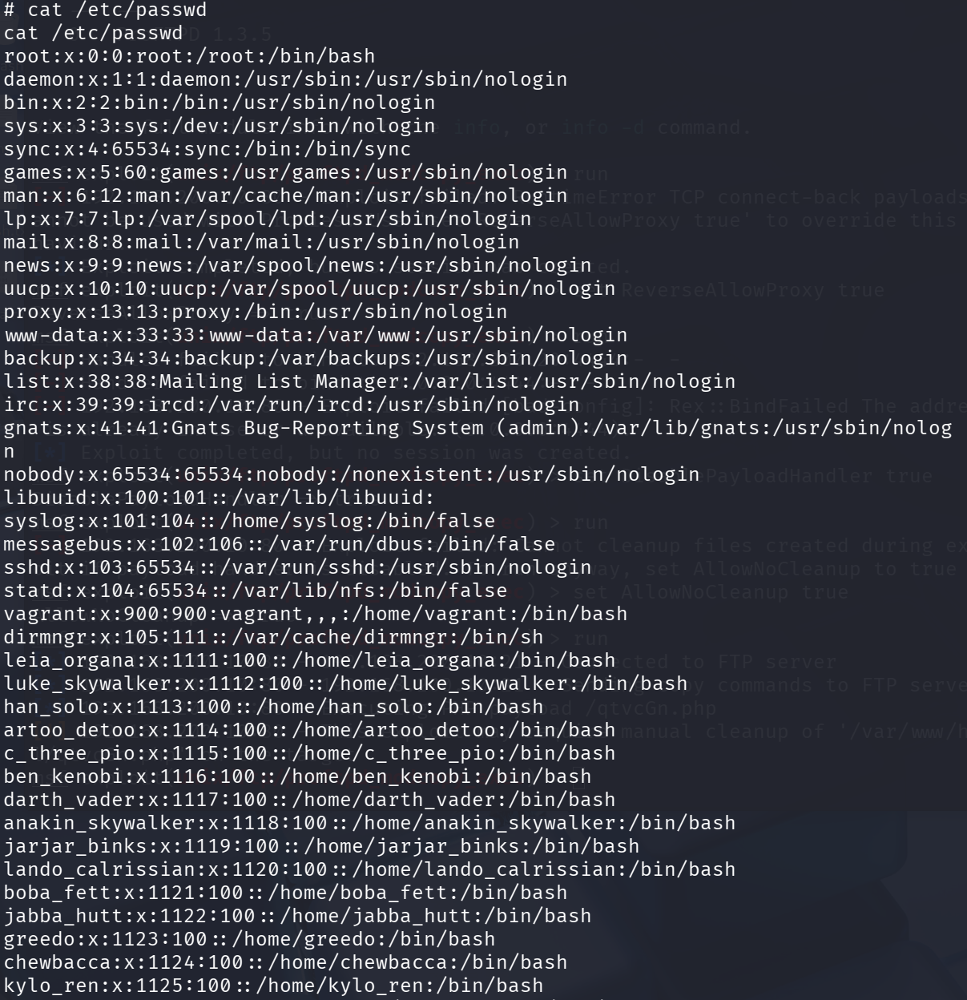

# Part 4: Lateral Movement

*MITRE ATT&CK: T1021.004 Remote Services: SSH, T1548 Abuse Elevation Control Mechanism*

**Goal:** Reach Metasploitable3 (`192.168.200.10`) from Kali. The only path is through the Ubuntu pivot.

This part took days. And the reason it matters is not the exploit at the end. It is everything that failed first, and the moment I stopped looking for a new exploit and started thinking about the actual problem.

---

## The Network Problem

Kali is on `192.168.100.x`. Metasploitable3 is on `192.168.200.x`. There is no direct route between them.

Ubuntu sits on both networks: `192.168.100.20` on the external side, `192.168.200.20` on the internal. With root on Ubuntu from Part 3, it was the obvious pivot point. The question was how to use it.

---

## Mapping the Internal Network

From the root shell on Ubuntu, swept the internal subnet to find what was actually there:

```bash
for i in $(seq 1 254); do ping -c 1 -W 1 192.168.200.$i | grep '64 bytes' & done; wait
```



Two hosts responded:

| IP | Notes |
|---|---|
| 192.168.200.10 | Metasploitable3 |
| 192.168.200.20 | Ubuntu (self) |

With a target confirmed, enumerated services on Metasploitable3 from the Ubuntu pivot:

| Port | Service | Version | Notes |
|---|---|---|---|
| 21 | FTP | ProFTPD 1.3.5 | mod_copy exploit (CVE-2015-3306) |
| 80 | HTTP | Apache | Payroll web application |
| 445 | SMB | Samba | File sharing |

---

## What I Tried First (And Why It Failed)

### SMB

The original plan was to exploit Samba over the SSH tunnel and get a shell. That died immediately. The Samba version on Metasploitable3 was patched against the exploits available. First dead end.

### ProFTPD mod_copy

ProFTPD 1.3.5 is vulnerable to CVE-2015-3306: unauthenticated SITE CPFR/CPTO commands that allow copying any file on the server. Used this to write a PHP reverse shell into the web root.

The exploit connected. The shell landed. And then nothing happened.

Watched the handler and got no callback. Ran it again. Nothing.

It took a while to understand why. A reverse shell means the target initiates the connection back to the attacker. Metasploitable3 is on `192.168.200.x`. It has no route to Kali on `192.168.100.x`. The shell executed, tried to call home, found no path, and died silently. The exploit worked perfectly. The network made it useless.

Filed that away and moved on.

### Drupal

Metasploitable3 runs Drupal 7.5 from 2011. Drupalgeddon2 targets Drupal 7.x, so it looked promising. But MS3's version predates the vulnerability entirely. The attack surface does not exist there. Dead end.

### SQL Injection in payroll_app.php

A payroll application at `http://192.168.200.10/payroll_app.php` was accessible from the Ubuntu pivot. Default credentials `admin / admin` granted login.



Confirmed a SQL injection vulnerability manually in Burp Suite. Sending `' OR 1=1-- -` as the username caused the entire database to dump.



The injection was real. Tried to weaponize it using MySQL's `INTO OUTFILE` to write a PHP shell directly to the web root. That failed: MySQL had `secure_file_priv` set to a restricted directory that Apache does not serve. The database could not write to where the web server would execute it.

Tried SQLmap to automate the injection. Despite having already proven the vulnerability by hand, SQLmap kept flagging it as a false positive and refused to exploit it. The tool was wrong. The vulnerability was real. But neither path got a shell.

### FTP Brute Force

Ran Hydra against ProFTPD. Nothing useful.

### Proxychains

At some point during all of this, I was trying to route traffic through an SSH tunnel using Proxychains. Proxychains forces a program's TCP connections through a proxy. In this case, the SOCKS proxy created by the `-D` flag on an SSH connection.

The problem: Proxychains was configured to use port `9050`, which is Tor's default. My SSH SOCKS proxy was on port `1080`. Every connection had been silently timing out for hours because it was pointed at nothing.

Finding that was both a relief and genuinely infuriating.

---

## The Actual Solution

After all of that, I stopped looking for a new exploit and actually thought about the network.

The constraint was not the target. The constraint was the callback path. Every reverse shell that ran on Metasploitable3 tried to connect back to Kali, and MS3 has no route to Kali. That is why the ProFTPD shell died. That would be why any reverse shell died.

But MS3 can reach Ubuntu. I have root on Ubuntu. And Ubuntu can reach Kali.

What if the shell called back to Ubuntu instead of Kali? And what if Ubuntu was configured to forward that connection to Kali automatically?

Nobody told me this. I worked it out from what I understood about the network topology. That is reverse port forwarding.

**How it works:** Instead of Kali pushing a tunnel to Ubuntu (local forward), Ubuntu pushes a tunnel to Kali (reverse forward). The `-R` flag tells the SSH server — Ubuntu — to listen on a port and forward any connection it receives back through the SSH session to Kali. If Ubuntu listens on `192.168.200.20:4444` and MS3 calls back there, Ubuntu relays the connection to Kali's handler. From MS3's perspective, it is talking to Ubuntu. From Kali's perspective, it is receiving the shell.

One catch: SSH only binds reverse-forwarded ports on `127.0.0.1` by default. Nothing outside the machine could connect to it. Ubuntu needed to bind on `0.0.0.0` so that MS3 could actually reach it. That required enabling `GatewayPorts yes` in Ubuntu's `sshd_config`.

---

## Setting Up the Reverse Tunnel

On Ubuntu, enabled `GatewayPorts`:

```
# /etc/ssh/sshd_config
GatewayPorts yes
```

Restarted sshd, then established the reverse tunnel from Kali:

```bash
ssh -i ~/pivot_key -R 4444:127.0.0.1:4444 root@192.168.100.20 -N &
```

This tells Ubuntu to listen on port `4444` on all interfaces and forward incoming connections back through the SSH session to port `4444` on Kali. Confirmed Ubuntu was binding correctly:

```bash
ss -tlnp | grep 4444
# LISTEN 0  128  0.0.0.0:4444  0.0.0.0:*
```



---

## Exploit Metasploitable3

Ran the ProFTPD mod_copy exploit again, same exploit as before, but this time the reverse shell payload was configured to call back to `192.168.200.20` (Ubuntu's internal address) on port `4444`. MS3 can reach that. The handler on Kali was waiting at the other end of the tunnel.



A `multi/handler` on Kali caught the callback:

```
use exploit/multi/handler
set payload cmd/unix/reverse_perl
set LHOST 127.0.0.1
set LPORT 4444
run
```



**Shell received as:** `www-data@metasploitable3-ub1404`

---

## Privilege Escalation on Metasploitable3: PwnKit (CVE-2021-4034)

Metasploitable3 runs Ubuntu 14.04 with a vulnerable version of `pkexec`. The public PwnKit exploit compiles and runs in seconds:

```bash
cd /tmp
unzip main.zip
cd CVE-2021-4034-main
make
./cve-2021-4034
# whoami → root
```



---

## Post-Exploitation: User Enumeration

```bash
cat /etc/passwd
```



---

## Key Takeaways

- **The network was the obstacle, not the target.** Metasploitable3 had multiple exploitable services. The real problem was that any shell it launched could not reach Kali. Every failed attempt was actually a routing problem in disguise.
- **Tools fail. Vulnerabilities do not disappear.** SQLmap called a confirmed SQL injection a false positive. The injection was real. Understanding what you have proven manually matters more than trusting tool output blindly.
- **Reverse port forwarding solves the callback problem.** When the target cannot reach you, give it something it can reach, then tunnel the return path through a host that sits between you. That is the core insight of this entire part.
- **Dual-homed hosts are high-value targets.** Ubuntu sat at the boundary of both networks. With root on it, the 200.x segment was reachable regardless of how well Metasploitable3 itself was isolated.

---

[Part 3: Privilege Escalation](part3-privesc.md) | Next: [Part 5: Exfiltration](part5-exfil.md)
